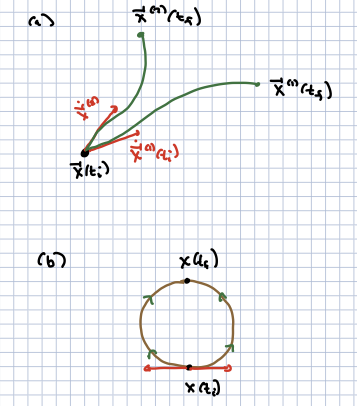
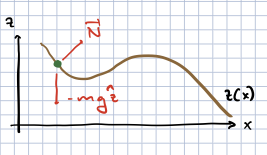
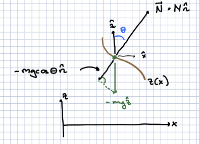

# Newtonian mechanics.

## The second law 

The classic presentation of Newton's second law of motion is the famous

```{math}
:label: newton_second
\begin{align}
{\vec F}_{k = 1,\ldots,M}(t) & = m_k {\vec a}_k \\
& \equiv m_k \ddot{\vec x}_k(t) \\
& \equiv m_k \frac{d^2}{dt^2} {\vec x}_k(t)
\end{align}
```


where we have written this for $M$ particles with masses $m_k$ and positions ${\vec x}_k(t)$ in 3 dimensions. It is important that the force is considered to be a known function of time and of the positions and velocities at that time. This equation is the core of Newtonian mechanics. (The first and third laws are also deep and important of course).

This is a *second order differential equation in time*. The upshot of this is that if we know the positions and velocities of the particles at some initial time $t_i$, we know the trajectories at all time. To start with, at time $t_i + \Delta t$,

```{math}
:label: newton_evolve
\begin{align}
{\vec x}_k(t_i + \Delta t) & = {\vec x}_k(t_i) + \Delta t \dot{\vec x}_k(t_1) + \ldots\\
\dot{\vec x}_k(t_i + \Delta t) & = \dot{\vec x}_k(t_i) + \Delta t \ddot{\vec x}_k(t_i) + \ldots \\
& = \dot{\vec x}_k(t_i) + \Delta t {\vec F}_k(t_i) + \ldots
\end{align}
```

where we have used the Taylor expansion in the small time scale $\Delta t$, and dropped all terms of order ${\cal O}(\Delta t^2)$. So with the initial conditions and the force given at initial time $t_i$, we then know the positions and velocities at $t_i + \Delta t$. The same argument gives us the positions and velocities at time $t_i + 2 \Delta t$ and so forth. Of course we still have the higher-order terms, but eventually we can take the limit $\Delta t \to 0$ and we get a contionuous trajectory determined by the initial positions and velocities.

Note that this interative process is essentially how we would solve the problems on a computer, though we might find a more sophisticated representation of the time derivative to control the ${\cal O}(\Delta t^2)$ errors.

The form given above is not the most general form of Newton's laws. In general, we write them as

```{math}
:label: second_general
{\vec F}_k(t) = \frac{d\vec p_k}{dt}
```

where ${\vec p}(t) = {\vec p}({\vec x}(t), \dot{\vec x}(t))$ is the *momentum*. In the classic version of Newton's laws that most people are familiar with, ${\vec p}_k = m_k {\vec x}_k$. But there are many cases for which the momentum that appears is a more complicated function of positions and velocities. One is the case of a particle in a magnetic field, which we will discuss later. Another is the case of particle mechanics in special relativity. In this case, the spatial momentum is:

```{math}
:label: sr_momentum
{\vec p}_k = \frac{m_k \dot{\vec x}_k}{\sqrt{1 - \dot{\vec x}_k^2/c^2}}
```

where $c = 3\times 10^8\ m/s$ is the speed of light. (The story looks more like the classic version if we work with 4-vectors and *proper* time, but practically you solve for the proper time in terms of time and get the dynamics shown.) This more general form of ${\vec p}$ is sometimes called the *generalized momentum*; it arises naturally in Lagrangian mechanics.

Another feature of Lagrangian mechanics is that it allows us to compute trajectories of systems from the initial and final positions ${\vec x}_k(t_i), {\vec x}_k(t_f)$. That you should be able to do this seems reasonable. Given initial positions and velocities you can deduce the final positions, the equations are deterministic, and the amount of data you specify each way is the same. (Actually it is more complicated than that because there can be multiple trajectories with different initial velocities and the same final positions: consider two particles moving in opposite directions on a circle, and bumping into each other later on).



  - (a) In many cases, trajectories can be specified by initial positions and velocities, or by initial and final positions.
  - (b) In some cases, the final positions do not specify the trajectories completely.
  
## Constrained systems

The next example I want to cover is an example of a system operating under a constraint, namely a bead on a wire, as shown in the picture below. The bead will move in the $(x,z)$ plane, confined to a wire whose shape is given by the function $z(x)$, and subject to the gravitational force ${\vec F}_{grav} = - m g {\hat z}$, where ${\hat z}$ is the unit vector in the $z$ direction. Here moving "up" (away from the earth) corresponds to increasing $z$. Our goal will be to find the equations of motion of $x(t)$ (since $z(t)$ is given to us by $x$), in terms of $x, \dot{x}, \ddot{x}$. 



Part of what makes this problem difficult is that there are in fact two forces operating on the bead; the gravitational force, and the normal force. The normal force will depend on the trajectory of the bead and will adjust itself so that the bead follows the wire. One way to think of this is that the atoms in the wire are tiny ball-and-spring systems. The springs exert a force on the bead proportional to the distance they are compressed. Thus they will be compressed to the point that they will provide the precise force required, perpendicular to the wire, to keep the bead moving along the wire.

The point of this exercise is that it is laborious, and going over it should make you eager to find a better way to find the proper equations of motion.

Now locally, at a point $(x_0, x(z_0))$, the wire is curved. For infinitesimal motion, it can be approximated by a circle tangent to the curve, such that the curvature of the circle is equal to the curvature of the wire. This is sometimes called the "osculating circle". If the circle is defined by the curve $z_R(x)$, then near a specific $x(t)$, we can expand the curves in a Taylor series in $(x - x(t))$:

```{math}
:label: expand_curves
\begin{align}
z(x) & = z(x(t)) + (x - x(t)) z'(x(t)) + \half (x - x(t))^2 z''(x(t)) \\
& \qquad \qquad+ \frac{1}{6}(x - x(t))^3 z'''(x(t)) + \ldots \\
z_R(x) & = z_R(x(t)) + (x - x(t)) z'_R(x(t)) + \half (x - x(t))^2 z''_R(x(t)) \\
& \qquad \qquad + \frac{1}{6} (x - x(t))^3 z'''_R(x(t)) + \ldots
\end{align}
```

![Osculating circle][Osculating.png)

To solve this we demand that 

1. The direction ${\hat n}$ from $(x(t), z(x(t))$ along the diameter of the circle is identical to the direction normal to the curve, and 
2. The constant, linear and quadratic terms in the two equations in {eq}`expand_curves` should agree; that is,

```{math}
z(x(t)) = z_R(x(t))\ ; \ \ z'(x(t)) = z_R'(x(t))\ ; z''(x(t)) = z_R''(x(t))
```

This is enough to determine the radius R of the circle. We will not derive this here; the answer is

```{math}
R = \frac{\left(1 + (z'(x(t)))^2\right)^{3/2}}{z''(x(t))}
```

We can then consider infinitesimal motion away from $(x(t), z(x(t)))$ as infinitesimal motion on a circle of radius $R$. For a velocity $\dot{\vec x}(t)$, this requires a centripetal force ${\vec F} = {\hat n} \frac{m \dot{\vec x}^2}{R}$. This will be the sum of the normal force and the component of the gravitational force perpendicular to the curve at $(x(t), z(x(t)))$. If the normal force is ${\vec N} = N {\hat n}$, and $\theta$ is the angle of ${\hat n}$ from the $z$-axis, this means

```{math}
N - m g \cos\theta = \frac{m \dot{\vec x}^2}{R} 
```



Now it should be clear from the figure above that $z'(x) = \tan\theta$, so that

```{math}
\cos\theta = \frac{1}{\sqrt{1 + (z')^2}}
```

Furthermore, using the chain rule for motion along the wire, 

```{math} 
\dot{z} = \dot{x} z'(x) = \dot{x}\tan\theta
```

Using 

```{math}
\begin{align}
\dot{\vec x}^2 & = \dot{x}^2 \dot{z}^2 \\
& = \dot{x}^2\left(1 + (z')^2\right)\\
& = \dot{x}^2\left(1 + \tan^2\theta\right) = \frac{\dot{x}^2}{\cos^2\theta}
\end{align}
```

We find

```{math}
\begin{align}
N & = mg \cos\theta + \frac{m \dot{x}^2 z''}{\left(1 + (z')^2\right)^{3/2}\cos^2\theta}\\
& = \frac{m g + m \dot{x}^2 z''(x)}{\sqrt{1+ (z')^2}}
\end{align}
```

In the end, the only force in the $x$ direction is the horizontal component of the normal force, 

```{math} 
N_x = |N| \sin\theta = |N|\frac{z'}{\sqrt{1 + (z')^2}}
```

So that

```{math}
m \ddot{x} = N_x = \frac{m g z' + m \dot{x}^2 z' z''}{1 + (z')^2}
```

Note that the total force depends on the velocity $\dot{x}$ as well as the position.

This is quite complicated! It turns out there is a much easier way to impose constraints, which will become apparent once we introduce teh Lagrangian formulation of classical mechanics.

