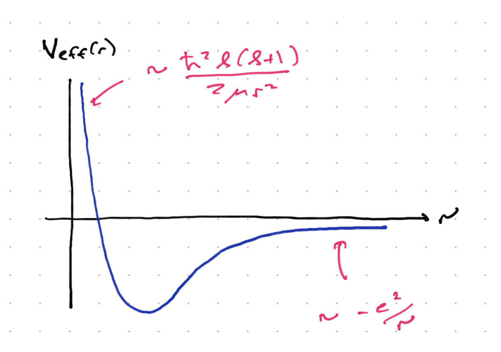
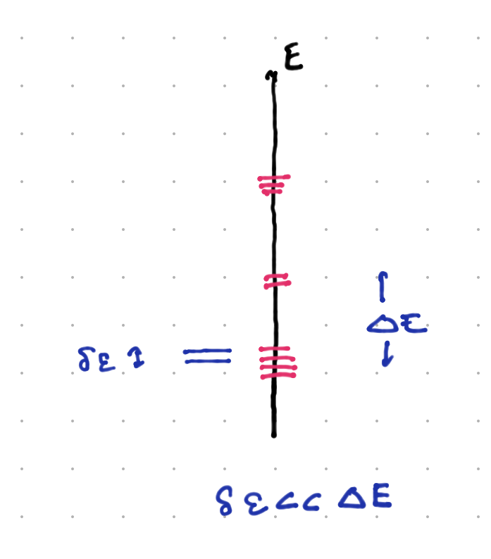

# Bound state spectra for the Coulomb problem

We now focus on solving the Coulomb problem:
```{math}
- \frac{\hbar^2}{2\mu}{\vec\nabla}^2 \psi({\vec x}) - \frac{e^2}{|{\vec x}|} \psi = (E - E_{com}) \psi
```
We will redefine $E - E_{com} \to E$ just to make reading (and writing) easier. 

Note that the reduced mass $\mu$ is
```{math}
\mu = \frac{m_e m_p}{m_e + m_p} = \frac{m_e}{1 + \frac{m_e}{m_p}} \sim m_e \left(1 - \frac{m_e}{m_p} + \cO(\frac{m_e^2}{m_p^2})\right)
```
since $\frac{m_e}{m_p} \sim 5\times 10^{-4}$, the reduced mass in this case is very close to the electron mass.

## Reduction to the radial equation

This Hamiltonian is invariant under rotations. It therefore makes sense to write the Schroedinger equation in spherical coordinates. This transformation is standard and it is worth it for you to work it out yourself. The end result is:
```{math}
- \frac{\hbar^2}{2\mu} \frac{1}{r} \frac{\del^2}{\del r^2} (r\psi) - \frac{\hbar^2}{2\mu r^2} {\vec L}^2\psi - \frac{e^2}{r} \psi = E\psi
```
Now all of the angular derivatives are contained in ${\vec L}^2$. Thus, we can us separation of variables, and write $\psi = f(r) \chi(\theta,\phi)$. Inserting this equation, and dividing by $\psi$, we find
```{math}
:label: separated_hydrogen
- \frac{\hbar^2}{2\mu f} \frac{1}{r} \frac{\del^2}{\del r^2} (rf) - \frac{1}{2\mu r^2 \chi} {\vec L}^2\chi - \frac{e^2}{r} = E
```
Further multiplying by $2\mu r^2$, there is only one term involving $\chi$ or any other function of the angular coordinates, which is the term proportional to ${\vec L}^2\chi$. Thus we can deduce that
```{math}
\frac{1}{\chi}{\vec L}^2 \chi = C
```
for some constant $C$. Multiplying this by $\chi$, we have an eigenvalue equation for the operator ${\vec L}^2$. But we know the solution -- $\chi$ mist be a spherical harmonic $Y_{\ell,m}(\theta,\phi)$, and $C = \hbar^2\ell(\ell + 1)$. Insering this into {eq}`separated_hydrogen`, we find:
```{math}
- \frac{\hbar^2}{2\mu} \frac{1}{r} \frac{\del^2}{\del r^2}(r f(r)) = \frac{\hbar^2 \ell(\ell + 1)}{2\mu r^2} f - \frac{e^2}{r} f = E f
```
Finally, if we multiply teh entire equation by $r$ and define $u = r f(r)$, we have and "effective" Schroedinger equation:
```{math}
- \frac{\hbar^2}{2\mu} \del_r^2 u(r) + \left[\frac{\hbar^2 \ell(\ell + 1)}{2\mu r^2} - \frac{e^2}{r}\right] u = E u
```
This is a one-dimensional Schroedinger equation with an "effective potential"
```{math}
V_{eff} = \frac{\hbar^2 \ell(\ell + 1)}{2\mu r^2} - \frac{e^2}{r}
```
This is sketched below. There is a COulomb potential and for $\ell \neq 0$, a "centrifugal barrier" keeping the electron from the proton. This barrier is absent for $\ell = 0$, and one might worry that the problem is ill-defined because the potential is singular. Classically, this is only a problem if we have truly point particles and fire them right at each other. Quantum-mechanically, we will see that the problem is well-defined for the correct choice of boundary conditions. In the end, $r$ is an operator, and $\vev{\frac{e^2}{r}}$ in any well-defined quantum state is finite.



It should be clear from this figure that we expect bound states for $E < 0$, since the wavefunction will be in the classically forbidden region for $r \to \infty$ and will die off exponentially. for $E > 0$ we expect a continuum of propagating states, desribing scattering of the electron and proton. 

## Boundary conditions for $u(r)$

Before continuing, we need to examine the boundary conditions for $u(r)$ at $r = 0$, $r = \infty$. In the latter case, since $V_{eff} \to 0$, the approximate solution is
```{math}
u(r) \sim e^{\pm \gamma r}\ ; \ \ \gamma = \sqrt{\frac{2\mu |E|}{\hbar^2}}
```
Clearly we need to choose the eponentially decaying solution (or the wavefunction is not normalizable).

For $r \to 0$, the story is a little more subtle. Let us first consider $\ell > 0$. As $r \to 0$, the centrifugal barrier term in the Schroedinger equation dominates $E u$ or $e^2 u/r$, because $1/r^2$ blows up more quackly that $1/r$. Thus, as $r \to 0$, the Schrodinger equation becomes
```{math}
- \frac{\hbar^2}{2\mu} \del_r^2 u + \frac{\hbar^2 \ell}{2\mu r^2} u = 0
```
multiplying through by $2\mu/\hbar^2$ we can see that both terms scale the same as $r \to \lambda r$; that is, they both scale as $\lambda^{-2}$. In this case, a solution of the form $u \propto r^{\alpha}$ makes sense. since both terms will reduce the power of $\alpha$ and can be balanced against each other. The result is
```{math}
- \alpha(\alpha - 1) + \ell(\ell + 1) = 0
```
which has solutions $\alpha = - \ell, \ell +1$. The former leads to a wavefunction of the form
```{math}
\psi = \frac{u}{r} Y_{\ell,m} \sim r^{-\ell - 1}
```
When we compute the norm, 
```{math}
\int dr r^2 d\phi \sin\theta d\theta |\psi|^2 \sim \int dr \frac{1}{r^{2\ell + 1}} + \ldots 
```
which clearly diverges; so we demand that $u\to r^{\ell + 1}$ as $r \to 0$.

When $\ell = 0$, the Coulomb term dominates, but scales differently in $r$. We assume that $u$ can be expanded in a power series, $u \sim r^{\alpha} (1 + a_1 t + a_2 r^2 + \ldots)$. Inserting this into the equation
```{math}
- \frac{\hbar^2}{2\mu} \del_r^2 u + \frac{e}{r} u = E u
```
the most singular term comes from the second derivative acting on $r^{\alpha}$, and is proportional to $\alpha(\alpha - 1)r^{\alpha - 2}$. This has the solutions $u \propto 1$ and $u \propto r$. In fact both are annihilated by the second derivative, but when we expand the solution to the full equation in a power series, we will see that it comes out OK.

Now $u \sim 1 \Rightarrow \psi \sim \frac{1}{r}$. While this is putatively ormalizable at the origin, it is in fact problematic; the wvafunction has a sharp kin at the origin. One can in fact show that ${\vec \nabla}^2 \frac{1}{r} \propto \delta(r)$. This delta function singularity cannot balance against the other terms in the Schroedinger equation. Thus, we demand that $u \sim r$.

## Power series solution

Before continuing, we will follow our treatment of the simple harmonic oscillator and try to make the Schrodinger equation one in terms of dimensionless variables. First, we note that for an energy $E$, as $r \to \infty$ the equation becomes
```{math}
\del_r^2 u = \frac{2\mu |E|}{\hbar^2} u
```
with the solution
```{math}
u \sim e^{- \sqrt{\frac{2\mu |E|}{\hbar^2}} r}
```
This dies off with a characteristic length scale $L = \sqrt{\frac{\hbar^2}{2\mu |E|}$. Defining $r = L \rho$, the radial Schroedinger equation becomes:
```{math}
- \del_{\rho}^2 u + \frac{\ell(\ell + 1)} u - \sqrt{\frac{2\mu}{\hbar^2|E|}}\frac{e^2}{\rho} u = u
```
We further define $\lambda = \sqrt{\frac{2\mu}{\hbar^2 |E|}}$. Next, we strip off the large-$\rho$ behavior by writing $u = e^{-\rho} G(\rho)$. The resulting equation is
```{math}
:label: G_equation
\frac{d}{d\rho^2}G - 2 \frac{d}{d\rho} G + \left[\frac{e^2\lambda}{\rho} - \frac{\ell(\ell + 1)}{\rho^2}\right]G = 0
```
These terms scale as either $\sigma^{-2}$ or $\sigma^{-1}$ as $\rho \to \sigma \rho$. If we expand $G$ in a power series, these terms will relate successive terms, leaving the possibility that the coefficients are at least determined by a recursion relation. From the discussion above, we try
```{math}
G(\rho) = \rho \sum_{n = 0}^{\infty} c_n \rho^n
```
Inserting this into Eq. {eg}`G_equation`, and collecting all terms of the same order in $\rho$, we find:
```{math}
\sum_{m = 1}^{\infty} \left[c_m(m + \ell + 1)(m + \ell) - \ell(\ell + 1) c_m - (2(m + \ell) - e^2\lambda)  c_{m-1}\right]\rho^{m - 1}
```
This is solved if
```{math}
\frac{c_m}{c_{m-1}} = \frac{2(m + \ell) - e^2 \lambda}{(m + \ell + 1)(m +\ell) - \ell(\ell + 1)}
```
Thus each $c_m$ is determined by the previous $c_{m-1}$. This leaves $c_0$ undetermined, but it will be fixed by normalization of the wavefunction.

Unfortunately, this power series will in general descibe a diverging wavefunction. So see this note that for large $m$, $c_m/c_{m-1} \sim 2/m$, so that $c_m \sim 2^m/m!$. Summing 
```{math}
\rho \sum_m c_m \rho^m \sim \rho \sum_m \frac{(2 \rho)^m}{m!} \sim \rho e^{2\rho}
```
This overwhelms the $e^{-\rho}$ behavior and renders the wavefunction non-normalizable.

The out is if the power series truncates at some order. Then the wavfunction scales as $\rho^m e^{-\rho}$ which is normalizable as $\rho \to \infty$. This means that there is some $m = 1, 2, 3, 4...$ such that $e^2 \lambda = 2(m + \ell)$. In other words,
```{math}
:label: hydrogen_energy
E = - \frac{\mu e^4}{2\hbar^2 n^2}
```
where $n = 1,2,3,\ldots = (m + \ell)$. This means that
```{math}
\rho - \frac{\mu e^4}{\hbar^2 n} r
```
so that the charateristic scale of exponential falloff is $L_n \sim \frac{\hbar^2 n}{\mu e^4}$. We call $L_1 = \frac{\hbar^2}{\mu e^4} = a_0$ the *Bohr radius$, defining the characteristic side of the ground state. 

At the end of the day, the wavefunction is a polynomial times an exponential. The polynomials turn out to be well-known functions. We can write the full solution as
```{math}
\psi(r,\theta,\phi) \propto Y_{\ell,m}(\theta,\phi) e^{-r/(n a_0)} \left(\frac{r}{n a_0}\right)^{\ell} L_{n-\ell-1}^{2\ell + 1}\left(\frac{2 r}{n a_0}\right)
```
where $L_n^m$ are the *associated Laguerre polynomials* whose properties can be looked up in a good book on special functions. Note that the characteristic scale is $n a_0$.

If we replace the proton with a nucleus with charge $Z$, the Coulomb potential gets replaced by $e^2/r \to Z e^2/r$. Then $a_0 \to a_0/Z^2$, and $E_n \to Z^2 E_n$. 

## The spectrum

As we stated, the bound states have energy {eq}`hydrogen_energy`. Looking back, we see that $n = \ell + m$ where $m \geq 1$. Thus, for any value of $m$, we have the possible values $\ell = n - 1, n -2, \ldots 0$. For $n > 1$ this is a highly degenerate spectrum because for each value of $\ell$ there is a $2\ell + 1$-dimensional subspace. This degeneracy is the result of an additional symmetry, that we will discuss below. 

It is standard to refer to $\ell = 0$ states by $S$; $\ell = 1$ states by $P$, $\ell = 2$ states by $D$, and so on.

Finally, note that the low-lying states are separated by energies of order a fraction of the magnitude of the ground state energy. As $n \to \infty$ the spacing becomes finer and finer, as the energy approaches zero and the wavefunction can spread out more and more. 

## Explaining the degeneracy

Whenever there is a large degeneracy, the lore is that there is some meaningful symmetry group for which the degenerate subspaces form irreps. "Meaningful" is what makes this statement interesting. Given a degeneracy one could always design a set of operators commuting with the Hamiltonian for which this is true. But usually it comes from some interesting feature of the dynamics.

(More generally, what happens in the real world is that we have some *approximate* degeneracies, as seen below:



In this case, when $\delta\eps \ll \Delta E$, we can often explain this by an "approximate symmetry", one in which the Hamiltonian is of the form $H_0 + H_1$ where $H_0$ is degenerate with level spacing $\Delta E$, and has a symmetry that forces this degeneracy; while $H_1$ breaks this symmetry but has $\cO(\delta\eps)$ matrix elements. We will see examples of this soon.) 

As it happens, in classical mechanics, there is a a conserved vectorial quantity called the *Runge-Lenz vector*:
```{math}
{\vec R} = \frac{1}{\mu} {\vec p}\times{\vec L} - \frac{e^2 {\vec r}}{r}
```
The classical Coulomb problem, being mathematically identical to the Kepler problem, supports elliptical orbits. The Runge-Lenz vector points from the force center (for us, $r = 0$) to the point of closest approach. This is true anywhere along the orbit, thus it is conserved. Note that it is only conserved for inverse-square law forces; if we change to some $1/r^{\alpha}$ central force with $\alpha \neq 2$, we lose that conservation law.

Deriving the degeeracy for this takes several steps. First, a highly nontrivial calculation yields:
```{math}
{\vec R}^2 = e^4 + \frac{2H({\vec L}^2 + \hbar^2)}{\mu}
```
Next, wf we promote ${\vec R}$ to an operator acting on the Hilbert space of the Hydrogen atom, we find that
```{math}
\begin{align}
[R^i, H] & = 0\\
[R^i, L_j] & = i\hbar \epsilon_{ijk} R^k\\
[R^i, R^j] & = - \frac{2i\hbar H}{\mu} \epsilon^{ijk}L_k
\end{align}
```

We consider only $E < 0$ states, and redefine
```{math}
{\vec K} = \sqrt{\frac{ - \mu}{2H}} {\vec R}
```
with this, we can calculate: 
```{math}
H = - \frac{\mu e^2}{2({\vec K}^2 + {\vec L}^2 + \hbar^2)}
```
Next, if we define
```{math}
\begin{align}
{\vec M} & = {\vec L} + {\vec K} \\
{\vec N} & = {\vec L} - {\vec K}
\end{align}
```
Here $M^i$ commutes with any component of ${\vec N}$, while
```{math}
\begin{align}
[M^i, M^j] & = i\hbar \eps^{ijk} M^k\\
[N^i, N^j] & = i\hbar\eps6{ijk} N^k
\end{align}
```
This is just two $SU(2)$ algebras. (Note that $SO(4)$, the space of rotations in 4d, is isomorphic to $SU(2)\times SU(2)$. However, their casimirs are not distinct. Since ${\vec L}$ is always perpendicular to the ellipse, ${\vec L}\cdot{\vec r} = 0$; and ${\vec L}\cdot({\vec p}\times{\vec L}) = 0$ automatically, we have ${\vec K}dot{\vec L} = 0$. This means that ${\vec M}^2 = {\vec N}^2$ = ${\vec K}^2 + {\vec L}^2$. Finally, we can show that
```{math}
H = - \frac{\mu e^4}{2(4{\vec M}^2 + \hbar^2)}
```

Now because it is part of an $SU(2)$ algebra, ${\vec M}^2$ has eigenvalues $\hbar^2 m(m+1)$, and the corresponding irreps with this eigenvalue have degeneracy $2m + 1$. In this case ${\vec N}^2 = \hbar^2(2m+1)$ also, so the total degeneracy is $(2m + 1)^2$. The energy eigenvalues are:
```{math}
H = - \frac{\mu e^4}{2\hbar^2(4m(m+1) + 1)} =  - \frac{\mu e^4}{2\hbar^2(2m + 1)^2}
```
Now if we let $m = 0,1/2,1,3/2,\ldots$, then $2m + 1 = 1, 2, 3, 4,\ldots$> In other words we can identify $n = (2m + 1)$. We have thus explained the $n^2$ degeneracy of the eigenstates of the Coulomb problem.


