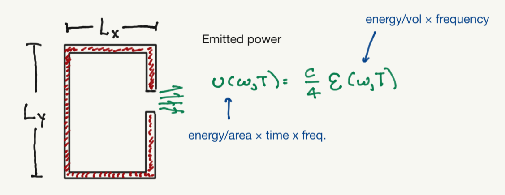
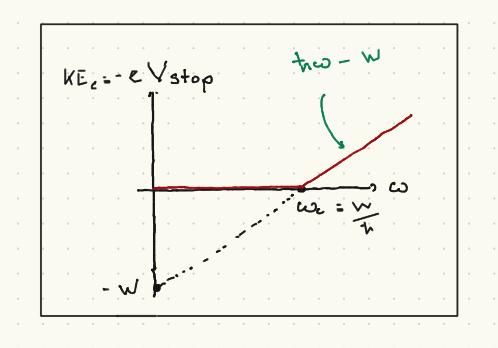

# Introduction to quantum mechanics

I will start with a quasi-historical, phenomenological discussion of some basic aspects of quantum mechanics:

1. The need for a new dimensionful quantity $\hbar$ with units [Energy $\times$ time].
2. The quantization of the energy of light with frequency $\omega$ into parcels ("photons") with energy $\hbar \omega$,
3. The fact that quantum states can be written as complex vectors, and that the sum of two such vectors is another legitimate quantum state.
4. The probabilistic nature of the outcome of quantum measurements.

These are all important; point (3) motivates a serious survey/review of linear algebra, which is also needed to discuss (4) more precisely.

## Blackbody radiation

Consider a cavity with walls at some temperature $T$, such that the electromagnetic field inside of the cavity is at equilibrium with the walls



 What is the expected energy density inside the cavity? We could (following many textbooks) try to comute this from classical electromagnetism, but we will appeal to dimensional analysis. 
 
 The total energy density should be an integral over all allowed frequencies:
 
 ```{math}
 :label: energy_density
 \CE(T) = \int_0^{\infty} \CE(T,\omega)
 ```
 
Here we are assuming that the volume of the box only appears in the total energy $E = V \CE(T)$, which is a thermodynamically extensive quantity. This makes sense if the box is very large compared to the wavelength of the light inside.

We have the following dimensionful quantities available to construct $\CE(T,\omega)$:
 
 1. The frequency $\omega$.
 2. The temperature writen as a thermal energy $k_B T$.
 3. The speed of light $c$.
 
 To get an energy density we can make an energy from $k_B T$ and a length scale $c/\omega$ (proportional to the wavelength). $\CE(T,\omega)$ should have units of energy denisty per frequency. The only combination of the above yielding a quantity with the right dimensions is:
 
 ```{math}
 :label: en_dens_dimanalysis
 \CE(T, omega) = A k_B T \left(\frac{\omega}{c}\right)^3 \frac{1}{\omega} = A \frac{k_B T}{c^3} \omega^2
 ```
 
where $A$ is a dimensionless constant that requires a first-principles calculation to obtain. This is called the "Rayleigh" law and $A$ was calculated by Rayleigh in 1900.

The total energy is thus
 
 ```{math}
 :label: total_energy_divergent
 \CE(T) = \left(\frac{A k_B T}{c^3}\right) \int_0^{\infty} d\omega \omega^2 = \infty
 ```
 
This is sometimes termed the "ultraviolet catastrophe".  What is needed is some new dimensionful scale, so that the integral is better behaved. One possibility is to just assume that the electromagnetic field has a largest possible frequency $\omega_{max}$ and the integral is cut off. 

However, the real issue is that the black body spectrum does not look like this. $\CE(\omega,T)$ is observable, for example by poking a small hole in the side of the black body and measuring the spectrum of teh emitted power (as illustrated above). It was already known that at high frequencies the black body spectrum follows the (phenomenological) Wien law $\CE(\omega,T) \sim \omega^3 e^{-c \omega/(k_B T}$, where $c$ is some constant (which must have units of [energy $\times$ time].)

Planck deduced a functional form that he later justifies with a hypothesis. We well cheat and start with that hypothesis. Let us fix the polarization state and the wavenumber ${\vec k}$ of a mode of the electromagnetic field (ignoring boundary conditions and such, this is all very handwavy to make a point). We assume that each mode has an energy that is an integer multiple of $\omega$:

```{math}
:label: planck_rule
\CE({\vec k}, {\hat n}_{pol}, \omega) = n \hbar \omega  ; \ \ n = \{0, 1,2,\ldots\}
```

whefre ${\hat n}_{pol}$ denotes one of teh two independent polarization states (linear, circular, etc). To get an expression appropriate for thermal equilibrium, we must do statistical mechanics. Boltzmann's hypopthesis states that the probability of the mode being in the state labelled by $n$ is:

```{math}
:label: Boltzmann
p_n = \frac{e^{-n \hbar \omega/(k_B T)}}{\sum_{m = 0}^{\infty} e^{-n \hbar \omega/(k_B T)}} = e^{-n\hbar\omega/(k_B T)}\left(1 - e^{-\hbar \omega/(k_B T)}\right)
```

where we have used the classic formula $\sum_{N = 0}^{\infty} x^N = \frac{1}{1 - x}$ for $x < 1$. To get the thermodynamic behavior, we need to compute the average energy per mode using the above probability distribution:

```{math}
:label: average_bb_ed
\begin{align}
\vev{\CE_n} & = \sum_n \CE_n p_n \\
& = \sum_n n \hbar \omega \left(1 - e^{-\hbar\omega/(k_B T)}\right) e^{-n\hbar\omega/(k_B T)} \\
& = \left(1 - e^{-\hbar\omega/(k_B T)}\right) (k_B T)^2 \frac{\del}{\del (k_B T)} \sum_n e^{-n\beta \omega/(k_B T)}\\
& = \frac{\hbar\omega e^{-\hbar\omega/(k_B T)}}{1 - e^{-\hbar\omega/(k_B T)}} \\
& = \frac{\hbar\omega}{e^{\hbar\omega/(k_B T)} - 1}
\end{align}
```

If we carefully sum over all wavenumbers (with fixed frequency) and polarizations, we get:

```{math}
:label: planck_spectrum
\CE(\omega, T) = \frac{\hbar \omega^3}{\pi^2 c^3} \frac{1}{e^{\hbar \omega/(k_B T)} - 1}
```

One can show that this takes the Rayleigh form for $\hbar\omega \ll k_B T$ and the Wien form for $\hbar\omega \gg k_B T$.
Finally, to tie this back to our earlier dimensional analysis, we can rewrite it as:

```{math}
:label: planck_scaling
\CE(\omega,T) = k_B T\frac{\omega^2}{c^3} f\left(\frac{\hbar\omega}{k_B T}\right)
```

where

```{math}
:label: planck_sf
f(x) & = \frac{1}{\pi^2} \frac{x}{e^x - 1)
```

In other words, the fact that we can create a new energy scale $\hbar\omega$ is what allows us to write a functional form for $\CE(\omega,T)$ consistent with the observed high- and low-frequency limits. Note that we now know the soure of this quantization (and we will say more about it below): light comes in "packets" consisting of individual particles known as *photons* with energy $\hbar\omega$.


This *black body spectrum* is observed with exquisite prediction. As an example, a prediction of the hot big bang theory is that the early universe had a phase in which electrons, protons, and photons were in a state of thermal equilibrium with temperature $T \sim 3000K$. The photons would then have the black body spectrum at this temperature. At $t \sim 10^5$ years after the big bang, the electrons and protons combined to form neutral hydrogen. The photons retained the blackbody spectrum; however, as the universe expanded, the photons redshifted. The functional form of the blackboddy spectrum is known to be retained, with the temperature appearing as a parameter that decreases with redshift. Thus, we should see a 
"cosmic microwave background radiation" (CMBR) today, a blackbody spectrum parametyerized by a temperature $T \sim 2.73K$. This has been observed to exquisite precision by the Cosmic Background Explorer (COBE) satellite which announced their results in 1992. (Different parts of the spectrum had been observed by earlier ground-based and balloon-borne experiments. This is a long and fascinating story with some interesting wrong turns. COBE showed that the spctrum was *truly* a blackbody spectrum from the Rayleigh through to the Wien range). There are small deviations from this, represented by local deciations in temperature, to a part in $10^5$. This is consistent with the hot big bang theory, and inn fact these small flcutuations are the seed for the cosmic structure we see today.

## The photoelectric effect

The next phenomenon was famously discussed by Einstein during his *annus mirabilis* of 1905. Consider a beam of light with frequency $\omega$ shining on an electrode comprised of some particular metal. A cathode can be reached by electons in the metal if they can travel across some voltage drop $V$.

Hertz observed the following in 1887:

1. The plates emit electrons (and no positvely charged particles)
2. Whether the plate emits electrons depends only on the frequency of the incoming light, and not on its intensity.
3. The magnitude of tte current in the cathode *is* proportional to the frequency
4. The energy of each photoelectron (as measured by mmeasuring for what $V$ an electron hits the cathode) is independent of the intensity of the light, and is linear in frequency, above some critical frequency $\omega_c$ which depends on the metal (and not on the photon frequency).



Einstein's interpretation was that light consistened of single particles or *\photons*, each of which carries an energy $\hbar \omega$. Electrons acquire kinetic energy by absorbing a single photon. To be ejected from the metal, the electron must cross a potential barrier $W = \hbar \omega_c$ which is intrinsic to that metal ($W$ is called the *work function* of the metal). The kinetic energy is for frequencies higher than $\omega_c$ is thus

```{math}
:label: pe_ke
\half m v^2 = \hbar(\omega - \omega_c)\theta(\omega - \omega_c)
```

where $\theta(x)$ is the Heaviside step function. The point here is that the packets of energy Placnk suggested could be interpreted as a single quantum or particle of light called a *photon* whose energy is related to their frequency by the dimensionfuil constant $\hbar$. Increasing the intensity of light does not change the energy of each photon, but the number of photons. If there is not a single photon with enough energy to eject an electron, no electron will be ejected.
