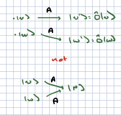

# Linear operators

In classical mechanics we saw that the states of the system were described as points on phase space. Observables of the system were functions on phase space, that could be described as generators of infinitesimal transformations.

In quantum mechanics, the space of ppossible states are described as vectors in a complex vector space (recall the discussion of photon polarization). Observables and generators of transformations are described as *operators* which map vectors to other vectors. More specifically, the correspond to *linear operators* which respect the linear structure of the vector space (addition and scalkar multiplication).

## Definitions

1. Let $V_1,V_2$ be two vector spaces over $\CF$. A **linear map** $F$ is a map
```{math}
f: V_1 \to V_2
```
such that
```{math}
:label: linear_map 
f(a \ket{v} + b \ket{w}) = a f(\ket{v}) + b f(\ket{w})\ \ \ \forall a,b \in \\CF\ ,\ \ \ket{v},\ket{w} \in V_1
```

Note that we can easily prove with this that for the zero vector $\ket{0}_1 \in V_1$, $f(\ket{0}_1) = \ket{0}_2 \in V_2$ where $\ket{0}_2$ is the zero vector.

2. For vector spaces $V_1, V_2$, over the *complex* numbers $\CC$, an **antilinear map** $f$ is a map $f: V_1 \to V_2$ such that
```{math}
:label: antilinear_map
f(a \ket{v} + b \ket{w}) = a^* f(\ket{v}) + b^* f(\ket{w})\ \ \ \forall a,b \in \ \CF\ ,\ \ \ket{v},\ket{w} \in V_1
```
where $a^*, b^*$ are the complex conjugates of $a,b$ respectively. This is important for defining adjoint vectors and normas of vectors.

3. Let $V$ be a vector space over $\CF$. A **linear operator** *f* is a linear map $F: V \to V$. 

For $\CF = \CC$, an **antilinear operator** *g* is an antilinear map $g: V \to V$. 

Antilinear operators include the operator that implements time reversal, which is important in various condensed matter physics and particle physics contexts.

Abstractly we usually denote operators by capital letters $A$ and the action of operators as $A: \ket{V} \to A\ket{v}$.

### Examples

1. The identity operator ${\bf 1}\ket{v} = \ket{v} \forall \ket{v}$. 

2. The zero operator $\varnothing: \ket{V} \to \ket{0}$.

3. More generally, scalar multiplication by any scalar in $\CF$ is a linear operator.

4. For $C = \CC^n$, $n \times n$ matrices acting on column vectors by the usual rules of matrix multiplication are all linear operators. In fact one can represent any finite-dimensional vector space of dimension $n$ by $\CC^n$, and every operator as a matrix acting on $\CC^n$.

5. A more interesting example: consider the (infinite-dimensional) space of all polynomials. We can represent these as 
```{math}
\ket{a_0,a_1,a_2,\ldots} = \sum_{k = 0}^{\infty} a_k x^k
```
The following operators
- shifts or multiplication by $x$

```{math}
S\ket{a_0,a_1,\ldots} = \ket{0,a_0,a_1,\ldots} = \sum_{k = 0}^{\infty} a_k x^{k+1} = x \sum_{k = 0}^{\infty} a_k x^{k}
```

- derivatives with repect to $x$

```{math}
T \ket{a_0,a_1,\ldots} = \ket{a_1,2 a_2,3 a_3,\ldots} = \sum_{k = 1}^{\infty}k_{k-1} k x^k = \frac{d}{dx} \sum_{k = 0}^{\infty} a_k x^k
```

are linear operators on $V$.

6. Relatedly, consider the vector space of square-integrable complex functions. You can convince yourself that multiplication by $x$ and differentiation are linear operators. There are some subtleties here; it can be that these take the function out of the Hilbert space (eg multiplication can, if $f$ falls off as $1/|x|$ at infinity).

## Operator algebras

In general we can combine operators to form new linear operator in various ways: technically, they define an *algebra:

1. Operators can be added: for operators $A_1,A_2$ acting on a vector space $V$, we can define
```{math}
:label: add_ops
(a A_1 + b A_2)\ket{v} \equiv a (A_1 \ket{v}) + b (A_2 \ket{v})
```
for any $\ket{v} \in V$, and $a,b \in \CF$.

It is straightforward to see that $(a A_1 + b A_2)$ is thus a linear operator, Note that $A + \varnothing = A$ under this rule, $A_1 + A_2 = A_2 + A_1$, and if $a = 0$, $a A = \varnothing$.

2. We can also multiply operators. For any two linear operators $A_1,A_2$, we define
```{math}
:label: op_mult
(A_1 A_2)\ket{v} = A_1(A_2\ket{v})
```
With a little work you can show that $A_1 A_2$ is a linear operator. Note that if $\bf{1}$ is the identity operator, $\bf{1} A = A \bf{1} = A$. Multiplication is *associative*: that is, if $A_3$ is also a linear operator, $((A_1 A_2) A_3) = (A_1(A_2 A_3))$. However, it does not have to be commutative. For example, for $V = \CC^n$ with operators equal to $n\times n$ matrices, operator multiplication is just matrix multiplication which is certainly not commutative. Consider $V = \CC^2$, and operators
```{math}
	A_1 = \begin{pmatrix} 0 & 1 \\ 1 & 0\end{pmatrix}\ ; \ \ A_2 = \begin{pmatrix} 1 & 0 \\ 0 & -1 \end{pmatrix}
```
then operator multiplication is simply matrix multiplication which we know is not commutative. In part
```{math}
A_1 A_2 = \begin{pmatrix} 0 & -1 \\ 1 & 0 \end{pmatrix}\ ; \ \ A_2 A_1 = \begin{pmatrix} 0 & 1 \\ -1 & 0 \end{pmatrix} = - A_1 A_2 \neq A_1 A_2
```

In general we measure the lack of commutativity with the *commutator*:
```{math}
:label: commutator
[A_1,A_2] = A_1 A_2 - A_2 A_1
```
Note that the commutator is itself a linear operator.

## Kernel, range, and inverse

### Kernel of an operator and injective maps

1. **Definition**: Consider a vector space $V$ and a linear operator $A$ acting on it. The *kernel$ of $A$ is defined as
```{math}
:label: kernel
\text{Ker}(A) = \left\{ \ket{v}\in V | A\ket{v} = \ket{0} \right\}
```
As an example, consider $V = \CC^4$, and the operator
```{math}
A = \begin{pmatrix} a & 0 & 0 & b \\ c & 0 & 0 & d \\ e & 0 & 0 & f \\ g & 0 & 0 & h\end{pmatrix}
```
for $a,\ldots h \in \CC$. With a little work you can show that
```{math}
\text{Ker}(A) = \left\{ \begin{pmatrix} 0 \\ c_1 \\ c_2 \\ 0 \end{pmatrix}\ \  \forall\ c_{1,2} \in \CC \right\}
```

Note that this is a vector subspace of $\CC^4$. This is no accident, as we can prove:

2. **Theorem**. For any vector space $V$ and linear operator $A$ acting on it, $\text{Ker}(A)$ is a vector subspace of $V$. (The proof in your problem set for the week).

3. **Definition**. A linear operator $A$ acting on a vector space $V$ is *injectove* or *one-to-one* if
```{math}
:label: injective
A\ket{v} = A\ket{w} \Rightarrow \ket{v} = \ket{w}
```



Finally, we note that these concepts can be extended naturally to maps between *different* vector spaces, though we will not use them in that context here.

4. **Theorem**. A linear operator $A$ is injective if and only if $\text{Ker}(A) = 0$.

### Range and surjective maps

1. **Definition**. Consider a linear operator $A$ actig on a vector space $V$. The *range* of $A$ can be fined as

```{math}
:label: range_op
\text{Range}(A) = \{A\ket{v}\ \forall \ket{v} \in V\}
```

As an example consider $V = \CC^4$,

```{math}
	A = \begin{pmatrix} 0 & 0 & 0 & 0 \\ a & b & c & d \\ e & f & g & h \\ 0 & 0 & 0 & 0 \end{pmatrix}
```

Then

```{math}
\text{Range}{A} = \{ \begin{pmatrix} 0 \\ c_1 \\ c_2 \\ 0 \end{pmatrix}\ \forall\ c_{1,2} \in \CC \}
```

2. **Theorem**: for any vector space $V$ and linear operator $A$ acting on that space, $\text{Range}(A)$ is a vector subspace of $V$. I leave the proof as an exercise.

3. **Definition** For a vector space $V$, a linear operator $A$ acting on it is *surjective* or *onto* if $\text{range}(A) = V$. 

4. **Definition** For a linear operator $A$ acting on a vector space $V$, the *rangk* of $A$ is $\text{Rk}(A) = \text{dim}(\text{RAnge}(A))$. 

5. **Rank-nullity theorem**: For a linear operator $A$ acting on a vector space $V$,

```{math}
:label: rank-nullity
\text{dim}(\text{Ker}(A)) + \text{Rk}(A) = \text{dim}(V)
```

The proof can be found in Zweibach's book {cite:p}`zwiebach2022mastering`, from which much of the material in this section is taken.

As an example, consider $V = \CC^4$, 

```{math}
A = \begin{pmatrix} 0 & 1 & 0 & 0 \\ 0 & -1 & 1 & 0 \\ 0 & 1 & 1 & 0 \\ 0 & -1 & 0 & 0 \end{pmatrix}
```

Then

```{math}
\text{Ker}(A) = \{ \begin{pmatrix} c_1 \\ 0 \\ 0 \\ c_4 \end{pmatrix}\ \forall\ c_{1,4} \in \CC \}
```

This two-dimensional vector space has as a basis

```{math}
\ket{v_1} = \begin{pmatrix} 1 \\ 0 \\ 0 \\ 0 \end{pmatrix}\ ; \ \ \ket{v_2} = \begin{pmatrix} 0 \\ 0 \\ 0 \\ 1 \end{pmatrix}
```

Meanwhile 

```{math}
\text{Range}(A) = \{ \begin{pmatrix} c_2 \\ - c_2 + c_3 \\ c_2 + c_3 \\ - c_2 \end{pmatrix}\ \forall\ c_{2,3} \in \CC \}
```

This space has as a basis 

```{math}
\ket{v_3} = \begin{pmatrix} 1 \\ -1 \\ 1 \\ -1 \end{pmatrix}\ ; \ \ \ket{v_4} = \begin{pmatrix} 0 \\ 1 \\ 1 \\ 0 \end{pmatrix}
```

It is also two-dimensional, so the rank of $A$ is 2.

One can show that $\ket{v_k}$ are all linearly independent. The rank of $A$ and the dimension of th ekernel are both $2$, and $2 + 2 = 4$ last time I checked, so the rank-nullity theorem holds.

### Inverses

For all the below we will consider a veector space $V$ and a linear operator $A$ acting on $V$.

1. **Definition**. $A_L^{-1}$ is the *left inverse* if $A_L^{-1} A = \bf{1}$.

2. **Theorem**: $A_L^{-1}$ exists if and only if $A$ is one-to-one.

**Proof**: First assume $A_L^{-1}$ iexists. Now consider $\ket{v_{1,2}}$ such that

```{math}
A\ket{v_1} = A \ket{v_2}
```
Then
```{math}
\begin{align}
A_L^{-1}\left( A\ket{v_1} - A\ket{v_2}\right) & = A_L^{-1} \ket{\varnothing} = 0\\
& = \ket{v_1} - \ket{v_2}
\end{align}
```
Thus $\ket{v_1} = \ket{v_2}$ and $A$ is one-to-one.

 On the other hand, assume that $A$ is one-to-one. Now consider a basis $\ket{v_i}$ of $V$. Now any linear combination $\sum_i c_i\ket{v_i} = 0$ if and only if $c_i = 0\ \forall\ i$. Since $A$ is a linear map, consider $\sum_i c_i A \ket{v_i} = A (\sum_i c_i \ket{v_i})$. Since $A$ is one-to-one, this can only be zero if $\sum_i c_i \ket{v_i} = 0$ which as we have already said means that $c_i = 0$. Therefore, $A\ket{v_i} \equiv \ket{w_i}$ is also a linearly independent set of vectors, and a basis for $V$. We can then *define*
 
 ```{math}
 A_L^{-1} \ket{w_i} = \ket{v_i}
 ```
 
 Since $\ket{w_i}$ is a basis, we simply demand that $A_L^{-1}$ is a linear operator, and this then determines the action of $A_L^{-1}$ on all vectors. Finally, we can see
 
 ```{math}
 A_L^{-1} A \left(\sum_i c_i \ket{v_i}\right) = A_L^{-1} \sum_i c_i w_i = \sum_i c_i \ket{v_i}
 ```

for any $c_i$, so $A_L^{-1} A = \bf{1}$.

3. **Comment**. Assume $A$ has a left inverse. Then we can solve the equation
```{math}
A\ket{v} = \ket{w}
```
for $\ket{v}$ given $\ket{w}$ by acting on both sides of the equation by $A_L^{-1}$ to ket $\ket{v} = A_L^{-1} \ket{w}$. However, we *cannot necessarily check that this is a solution*: we can act on both sides by $A$ but then $A \ket{v} = A A_L^{-1} \ket{w}$  and we have no guarantee that $A A_L^{-1} = \bf{id}$. This becomes a particular issue for infinite-dimensional vector spaces. Consider the space of all polynomials

```{math}
\ket{a_0,a_1,a_2,\ldots} \Rightarrow \sum_{k=0}^{\infty} a_k x^k
```

Now if we define:

```{math}
\begin{align}
S\ket{a_0,a_1,a_2,\ldots} & = \ket{0,a_0,a_1,\ldots} \\
S_L^{-1}\ket{a_0,a_1,a_2,\ldots} & = \ket{a_1,a_2,a_3,\ldots}
\end{align}
```

we can see quickly that

```{math}
\begin{align}
S_L^{-1} S\ket{a_0,a_1,a_2,\ldots} & = \ket{a_0,a_1,a_2,\ldots}\\
S S_L^{-1} \ket{a_0,a_1,a_2,\ldots} & = \ket{0, a_1, a_2, a_3,\ldots}
\end{align}
```

Thus $S_L^{-1} S = \bf{1}$ but $S S_L^{-1}$ does *not* act as the identity: it strips off the constant term from the polynomial. 

4. **Definition**. $A_R^{-1}$ is a *right inverse* if
```{math}
A A_R^{-1} = \bf{1}
```

5. **Theorem**: $A_R^{-1}$ exists if and only if $A$ is onto. We will not prove this here (the proof is complicated).

Again, we can furnish an example for which $A A_R^{-1} = \bf{1}$ and $A_R^{-1} A \neq \bf{1}$, by looking at the polynomials. Let 

```{nath}
\begin{align}
T \ket{a_0, a_1, a_2,\ldots} & = \ket{a_1, 2 a_2, 3 a_3,\ldots}\\
T_R^{-1} \ket{a_0,a_1,a_2,\ldots} & = \ket{0, a_0, \frac{1}{2} a_1, \frac{1}{3} a_2,\ldots}
\end{align}
```

We find
```{math}
\begin{align}
T T_R^{-1} \ket{a_0,a_1,a_2,\ldots} & = \ket{a_0,a_1,a_2,\ldots}\\
T_R^{-1} T \ket{a_0,a_1,a_2,\ldots} & = T_R^{-1} \ket{a_1,2 a_2,\ldots}\\
& = \ket{0, a_1, a_2,\ldots}
\end{align}
```
so $T_R^{-1}T$ fails to be the identity operator because (once again) it strips off the constant term.

6. **Definition**. A linear operator $A$ is *invertible* if $A_R^{-1}$, $A_L^{-1}$ exist.

7. **Theorem**. If $A$ is invertible, $A_L^{-1} = A_R^{-1} \equiv A^{-1}$.

**Proof**. $A_L^{-1} A A_R^{-1} = A_L^{-1} = A_R^{-1}$ by associativity of operator multiplication.

8. **Theorem**. $A$ is invertible if and only if it is one-to-one and onto.

9. **Theorem**. Consider $V$ such that$dim(V) = d < \infty$. Then $A$ being invertible, $A$ being one-to-one, and $A$ being onto are all equivalent.

**Proof**. This follows form the rank-nullity theorem. We have shown that $A$ being invertible means it is one-to-one and onto. If $A$ is one-to-one, then $\text{dim}(\text{Ker}(A)) = 0$, so by the rank-nullity theorem $A$ has rank $n$; this means $A$ has all of $V$ as its image so it is onto. Similarly if $A$ is onto, the rank-nullity theorem shows that $\text{dim}(\text{Ker}(A)) = 0$ so $A$ is one-to-one.

