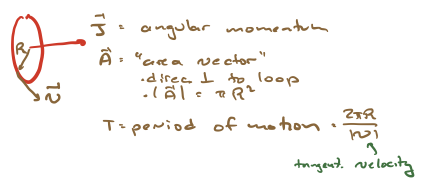

# Example: spin-1/2 particles

The goal of these notes is to consider the rules of quantum mechanics for the simplest possible case, $V = \CC^2$. This is a physics course so we should give a physical realization of this simplest case! One such realization is the angular momentum states of "spin-$\half$ particles. We will give a broad-brush and not precisely motivated description of such systems. A fuller description will have to wait until we discuss the theory of angular momentum.

## Classical picture of magnetic moments

Although I keep saying "we should just take quantum mechanics at face value" it is sometimes good to know how they relate to classical analogs; here in particular we will introduce some concepts that are best explained by relating the quantum and classical cases.



To warm up, let us consider a particle with charge $q$ and mass $%m$ moving in a circular orbit with radius $R$ and constant tangential speed $v$. Classically, we can say:

- The period of the motion is $T = \frac{2\pi R}{v}$. 

- If we consider times scales longer than this period, the current through the wire is $I = \frac{q}{T}$. 

- We can define a *magnetic moment* as $\vec{\mu} = I {\vec A}$. We can rewrite this as:
```{math}
:label: classical_mm
|{\vec A}| = \pi R^2 = \half (2\pi R)R = \half T v R = \frac{T}{2m} p R
```
where $p = m v$ is the linear momentum. Now, the magnitude of the angular momentum of the particle (with respect to the center of the loop) is $j = |{\vec J}| = p R = m v R$. The angular momentum is a vector ${\vec J}$; it points in the same direction as ${\vec A}$. We can thus write
```{math}
:label: classical_mm_two
{\vec \mu} = \frac{q}{T} \frac{T}{2m} {\vec J} = \frac{q {\vec J}}{2m}
```

- If we place this system in a magnetic field ${\vec B}$, there is a potential energy 
```{math}
:label: pe_magmom
U = - {\vec \mu}\cdot{\vec B}
```

## The Stern-Gerlach experiment


