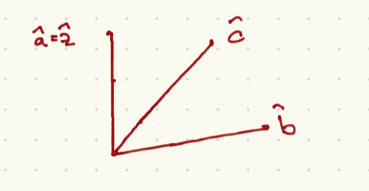
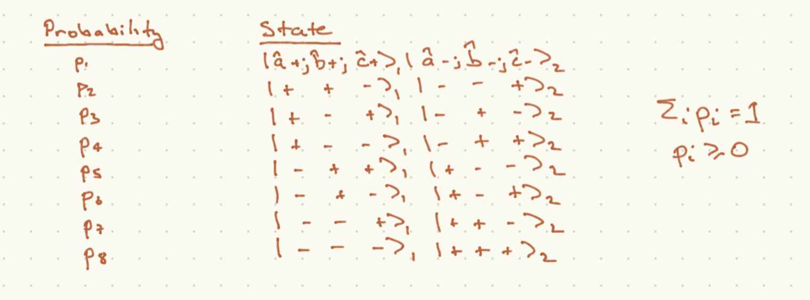

# Local Realism vs. Quantum Mechanics

We close this chapter by working out a rewalization of John Bell's that we can *test* quantum mechanics against a while class of models which capture the demand that there be some underlying theory which is completely local and deterministic such taht probbilities truly capture our ignorance of some microscopic degrees of freedom. These are known as ``local hidden variable theories".

It is easiest to define these with respect to an EPR experiment. Let us assume that we have two spin-$\half$ particles (or alternatively two photons emitted back to back in some definite direction), such that their combined spin (equivalently polarization) states are:
```{math}
:label: spin_zero
\ket{\psi} = \frac{1}{\sqrt{2}}\left(\ket{+,z}\ket{-,z} - \ket{-,z}\ket{+,z}\right)
```
Note by the way that for any unit vector $\hat{n}$, the state can be written as
```{math}
:label: spin_zero_two
\ket{\psi} = \frac{1}{\sqrt{2}}\left(\ket{+,{\hat n}}\ket{-,{\hat n}} - \ket{-,\hat{n}}\ket{+,{\hat n}}\right)
```
The minus sign between the two components is crucial here. You can showthis by brute force; when we discuss addition of anglar momentum, the point will be that the system has vanishing total (spin) angular momentum, so it is invariant under rotations.

As we discussed, if the two particles are separated such that the spin state remain described as above, measurments of one spin along a given axis are perfectly correlated wth measurements of the other spin along the same axis. Note however that if the two measurements are made along *orthogonal* axes there is no such correlation. Spin with definite sign along the $z$ axis will take values $\pm \frac{\hbar}{2}$ along the $x$ axis with $50-50$ probability.

The particular set of theories that we will test against quantum mechanics are *Locally realistic hidden variable* theories. Let's define each in term.

- *Local realism*. We demand that properties of a given particle, such as the outcomes of any measurement of the spin measured along any axis are *intrinsic* to the particle. In our EPR example, if we decide to measure particle 1 along the $z$ axis and particle 2 along the $x$ axis, we can label each particle by $\ket{z,\alpha; x,\beta}$, where $\alpha,\beta = \pm\frac{\hbar}{2}$. Thus the set of different two-particle states are $\ket{z,\alpha_1;x,\beta_1}\ket{z,\alpha_2;x,\beta_2}$, Here we have suppressed lables corresponding to possible measurements along other axes, and ewe have accepted that the measurement along any axis will always yield $\pm ]frac{\hbar}{2}$.

- Now quantum mechanics tells us that the outcomes of measurements have a fundamentally probabilistic character. in distinction, *Hidden variable* theories, the probabilities are governed by unknown degrees of freedom to which we assign classical probabilities that reflect our ignorance of these degrees of freedom.

Our question is, can we reproduce the results of quantum mechanical measurement with these rules? Bell's insight was that you cannot.

As an example, we can consider the case that each particle is in one of the four following states with equal ($25\%$) probability:
```{math}
\begin{align}
\ket{z,+;x,-}_1\ket{z,-;x,+}_2\\
\ket{z,+;x,+}_1\ket{z,-;x,-}_2\\
\ket{z,-;x,+}_1\ket{z,+;x,-}_2\\
\ket{z,-;x,-}_1\ket{z,+;x,+}_2
\end{align}
```
As it happens, we can completely reproduce the results of quantum mechanics if we only make measurements along the $x$ or $z$ axis for each particle. In particular if both particles are measured along the same axis, the results will be correlated. But there is nothing fundamentally correlated about these states.

As it happens, this example is too simple. Consider instead a set of three axes along which we might make a measurement, as shown here:



We demand that for any case that the measurements of the two spins are both taken along the same axis, the results corralated as they are in the quantum case {eq}`spin_zero_two`. The probabilities for each of the 8 possible outcomes of a measurement of each particle along any of the axes $a,b,c$ are captures in the following table:



Now we can put some bounds on these classical probabilities. Positivity or probabilities means that
```{math}
:label: be_one
p_3 + p_4 \leq p_3 + p_4 + p_2 + p_7 = (p_2 + p_4) + (p_3 + p_7)
```
Now we can relate these sums to various outcomes:
```{math}
:label: joint_prob
\begin{align}
p_3 + p_4 & = p({\hat a}_1\cdot{\vec S}_1 = \frac{\hbar}{2}; {\hat b}_2\cdot{\vec S}_2 = \frac{\hbar}{2})\\
p_2 + p_4 & =  p({\hat a}_1\cdot{\vec S}_1 = \frac{\hbar}{2}; {\hat c}_2\cdot{\vec S}_2 = \frac{\hbar}{2})\\
p_3 + p_7 & =  p({\hat c}_1\cdot{\vec S}_1 = \frac{\hbar}{2}; {\hat b}_2\cdot{\vec S}_2 = \frac{\hbar}{2})
\end{align}
```
The probabilities on the RHS are *joint probabilities*, not *conditional probabilities*. With this in mind, in the first line, cases 3 and 4 are the only two cases with ${\hat a}_1\cdot{\vec S}_1 = \frac{\hbar}{2},  {\hat b}_2\cdot{\vec S}_2$, and similarly for the next two cases. Now {eq}`be_one` combined with {eq}`joint_prob` leads to *Bell's inequality*
```{math}
:label: bell_ineq
p(a_1 = +,b_2 = +) \leq p(a_1 = +,c_2 = +) + p(c_1 = +, b_2 = +)
```
where we have taken ${\hat a}_1 \cdot {\vec S}_1 = \frac{\hbar}{2} \to a_1 = +$ and so on.
