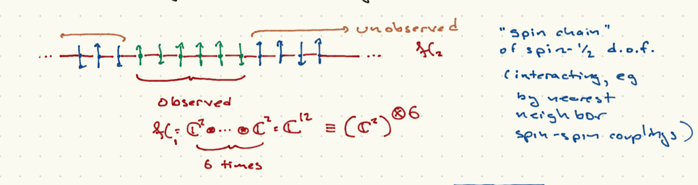

# Entangled states and density matrices

## Direct sums and tensor products

There are different ways to combine vector spaces to get new vectors spaces. We are particularly interested in the tensor product, but the direct sum is also important and the contrast is illuminating

### Direct sums

The direct sum $V = V_1 \oplus V_2$ is a method for adding new directions to the Hilbert space. For example, $\CR^3$ can be thought of as a combination of $\CR^2$ represented as the $x-y$ plane, and $\CR$ thought of as the $z$ axis. Another example would be a particle hopping between two sites; in one site there are three states. If these sites were ions and the particle an electron, they could be possible excitation levels of the particle at that site. The particle could be at either one site or the other, in any state associated to that site, or a linear combination of the two sites.

- **Definition**. Given vector spaces $V_1, V_2$, the *direct sum* $V = V_1 \oplus V_2$ is the set of all *ordered pairs* $\left(\ket{v}_1,\ket{v_2}\right)$ for $\ket{v}_i \in V_i$, such that 
```{math}
:label: ds_add
c \left(\ket{v}_1, \ket{v}_2\right) + d \left(\ket{w}_1, \ket{w}_2\right) = \left(c\ket{v}_1 + d \ket{w}_1, c \ket{v}_2, d \ket{w}_2\right)
```
for all $c,d \in \CC$. If we define the zero vector as $\left(0,0\right)$, this is a vector space.

Typically, we drop the ordered paits and simply write 
```{math}
:label: ds_notation
\left(\ket{v}_1,\ket{v}_2\right) = \ket{v}_1 + \ket{v_2}
```
which can be understood formally if we understand $\ket{v}_1 \equiv \left(\ket{v}_1, 0\right)$ and $\ket{v}_2 = \left(0,\ket{v}_2\right)$.

- *Basis and dimension*. Given a basis $\ket{i}, i = 1,\ldots,d_1$ of $V_1$ and a basis $\ket{I}, I = 1,\ldots, d_2$ of $V_2$, you can (and should) convince yourself that $\left(\ket{i}, 0\right)$ and $\left(0, \ket{I}_2\right)$ form a basis for $V_1 \oplus V_2$. This means that $\text{dim}(V_1 \oplus V_2) = \text{dim}(V_1) + \text{dim}(V_2)$.

- *Example*. Let $V_1 = \CC^2$ and $V_2 = \CC^3$. Then $V_1 \oplus V_2 = \CC^5$.In particular, we can represent
```{math}
\ket{v}_1 = \begin{pmatrix} c_1 \\ c_2 \end{pmatrix}\ ; \ \ \ket{v}_2 = \begin{pmatrix} d_1 \\ d_2 \\ d_3 \end{pmatrix}\ ; \ \ \left(\ket{v}_1, \ket{v_2}\right) = \begin{pmatrix} c_1 \\ c_2 \\ d_1 \\ d_2 \\ d_3 \end{pmatrix}
```

- It is clear that we can identify $V_1$, $V_2$ as vector subspaces of $V_1 \oplus V_2$. If $\ket{i}, \ket{I}$ are orthonormal and we demand $\brket{i}{I} = 0$, then $V_1 = (V_2)^{\perp}$ as subspaces of $V_1 \oplus V_2$.

- *Operators*. A linear operator $A_1$ acting on vector space $V_1$ can be lifted to a linear operator on $V_1 \oplus V_2$ via
$A_1 \left(\ket{v},\ket{w}\right) = \left(A_1 \ket{v},\ket{w}\right)$. Similarly for a linear operator $A_2$ acting on $V_2$, $A_2 \left(\ket{v},\ket{w}\right) = \left(\ket{v},A_2 \ket{w}\right)$. However, the sums of linear operators do not fill out all of the possible linear operators. Take the above example of $\CC^5$. The space of linear operators acting on $V_1$ is $M_2(\CC)$, the set of all $2\times 2$ complex matrices. For $V_2$ it is the set of all $3\times 3$ matrices. But for $V_1 \oplus V_2 = \CC^5$ it is the set of all $5\times 5$ matrices. This is a much bigger set of operators, and allows for operators that rotate $V_1$ and $V_2$ into each other. Specifically, if we write
```{math}
M \in M_5(\CC) = \begin{pmatrix} A^{11}_{2\times 2} & A^{12}_{2\times 3} \\ A^{21}_{3\times 2} & A^{22}_{3\times 3} \end{pmatrix}
```
then $A^{11}, A^{22}$ are the embeddings of linear operators acting on $V_1,V_2$ respectively, while $A^{12}, A^{21}\neq 0$ lead to new operators that only have meaning in the direct sum.

As an example, if $V_1$ corresponds to the states of an electron on one site, and $V_2$ the states of an electron on another site, then of the Hamiltonian is a sum $H = H_1 + H_2$ with $H_i$ acting on $V_i$, the eigenstates correspond to particles living on one site or another, and if the particle starts on a site it will stay on that site. On the other hand, if $H$ contains terms that mix the two sites, the eigenstates are lienar combinations of the particle being on one site or another; relatedly, the state vector of a partcile that starts on one site will acquire a component correspond to the particle siting on the other site.

## Tensor products

The tensor product emerges when you want to add an attribute to a given system. That is, consider a particle for which you can specify the position and spin degree of freedom. In this case the particle has position *and* spin, you can't either be in position ${\vec x}$ *or* have spin-up along the $z$ direction. Similarly, you might want to describe the states of *two* distinguishable particles such as a proton and an electron. You always have to say what each particle is doing.

The definition is a little more formal. 

- **Definition**. Given vector space $V_1$ with basis $\ket{i}, i = 1,\ldots, d_1$ and a second vector space $V_2$ with basis $\ket{I}, I = 1,\ldots, d_2$, the *tensor product* $V = V_1 \otimes V_2$ is the set of all formal symbols
```{math}
:label: tp_def
\ket{\alpha} = \sum_{i, I} \alpha_{iI} \ket{i}ket{I}
```
If $\ket{\beta}$ is similarly defined with coefficients $\beta_{iI}$, then  addition is defined as
```{math}
:label: tp_add 
c \ket{\alpha} + d \ket{\beta} = \sum_{i,I} (c \alpha_{iI} + d \beta_{iI})\ket{i}\ket{I}
```
for any $c,d \in \CC$. If we define the zero vector via $\alpha_{iI} = 0$, then $V_1\otimes V_2$ is a vector space.

- *Basis and dimension*. Clearly $\ket{i}\ket{I}$ form a complete basis, and so $\text{dim}(V_1 \otimes V_2) = \text{dim}(V_1) \times \text{dim}(V_2)$.

- *Example* Tensor product of general vectors. Given vectors $\ket{v}_1 = \sum_i v_i \ket{I}$ and $\ket{w}_2 = \sum_I w_I \ket{I}$ as elements of $V_1, V_2$ respectively, we can define
```{math}
\ket{v}_1 \ket{w}_2 = \sum_{i,I} v_i W_I \ket{i}\ket{I}
```

- *Basis independence*. It does not matter what basis we use to define the tensor product. You can easily show that a general vector written using the definition in one of the bases $\ket{i,I}$ and $\ket{{\tilde i}, {\tilde I}}$ has a unique expression in terms of the other basis.

- *Notation*. We sometimes write $\ket{i}\ket{I} \equiv \ket{i,I}$.

- *Example*. Consdier a spin-$\half$ particle moving in 3 dimensions. The Hilbert space is $\CC^2 \otimes L^2(\CR^3)$. We can write a general state as
```{math}
\ket{\alpha} = \ket{+,z}\ket{\psi_+} + \ket{-,z} \ket{\psi_-}
```
where $\psi_{\pm}$ denote square-integrable functions.
This is sometimes realized as a *spinor*, a 2d vector of wavefunctions
```{math}
\ket{\alpha} \Rightarrow \begin{pmatrix} \psi_+({\vec x}) \\ \psi_-({\vec x}) \end{pmatrix}
```

- *Linear operators*. Given linear operators $A_1,A_2$ acting on $V_1,V_2$ respectively, we can define the action of $A_1 \otimes A_2$ via
```{math}
A_1 \otimes A_2 \ket{v}\ket{w} = (A_1\ket{v})(A_2 \ket{w})
```
We can further add operators such as $A_1 \otimes A_2 + B_1 \otimes B_2$ so that
```{math}
(A_1 \otimes A_2 + B_1 \otimes B_2) \ket{v}\ket{w} = (A_1\ket{v})(A_2 \ket{w}) + (B_1\ket{v})(B_2 \ket{w})
```

 - *Inner products*. If $V_{1,2}$ are an inner product space, there is a natural inner product on the tensor product space indiucec by the following. Let $\ket{\alpha} = \ket{v_1}\ket{v_2}$, $\ket{\beta} = \ket{w_1}\ket{w_2}$; then we can write
 ```{math}
 :label: tp_inner
 \brket{\beta}{\alpha} = \brket{w_1}{v_1} \brket{w_2}{v_2}
 ```

 - *Dynamics* The typical structure of a Hamkiltonian in this situation is
 ```{math}
 H = H_1 \otimes {\bf 1} + {\bf 1}\otimes H_2 + g \sum_k A_k \otimes B_k
 ```
 where $g$ is a numnber included for convenience. When $g = 0$, the factors of teh tensor product are non-interacting. For the 2-particle case, what one particle is doing does not affect what the other paerticle is doing. However, if $g \neq 0$, the particles interact; the state of one affects the dynamics of the state of the other. Imagine two spin-$\half$ particles. The Hamkiltonian
 ```{math}
 H = - \mu_1 B S_{1,z} \otimes {\bf 1} - \mu_2 B {\bf 1}\otimes S_{2,z} + g \sum_{i}S_{1,i} \otimes S_{2,i}
 ```
can be thought of as two magnetic momnents in a magnetic filed ${\vec B} = B {\hat z}$. The last term can be thought of as saying that each particle feels a magnetic field proportional to the magnetic moment of the other particle.


## Entangled states

Given a tensor product Hilbert space $\cH = \cH_1 \otimes \cH_2$, we say that a state $\ket{\alpha} \in \cH$ is *entangled* if it cannot be written in the form
```{math}
:label: def_entangled
\ket{\alpha} = \ket{v}_1 \ket{w}_2
```
An example works best to illustrate this. Consider two spin-$\half$ particles. The following states form a basis of $\CC^2\otimes\CC^2$:
```{math}
:label: two_spin_basis
\begin{align}
\ket{\psi_1} & = \ket{+,z}\ket{+,z}\\
\ket{\psi_2} & = \frac{1}{\sqrt{2}}\left(\ket{+,z}\ket{-,z} + \ket{-,z}\ket{+,z}\right)\\
\ket{\psi_3} & = \ket{-,z}\ket{-,z}\\
\ket{\psi_4} & = \frac{1}{\sqrt{2}} \left(\ket{+,z}\ket{-,z} - \ket{-,z}\ket{+,z}\right)
\end{align}
```
$\ket{\psi_{1,2}}$ are clearly unentangled. $\ket{\psi_{2,4}}$ are entangled and in fact there is no way to write them as unentangled states. We will show a tool that can test whether the state of two systems is entangled or not, when we introduce density matrices and the *von Neumann entropy*.

As we can see from the above, quantum entanglement denotes a correlation between the state of two degrees of freedom in a tensor product. This yields some surprising results. For example, assume that we prepare the two spin states of a particle in $\ket{\psi_4}$. We can do this in such a way that the two particles are separated by a large distance. Even at this separation, the results of measuring $S_z$ for the first particle are *always* correlated with the results of measuring $S_z$ for the second particle: if one is measured as spin up, the other is measured as spin down. This is true even if the measurements are made simultaneously, so that no light signal could pass between the two particles. This is the famous *Einstein-Podolsky-Rosen* paradox. Note that since the particles would have to be prepared with the spins so entangled when they were in causal contact, and then separated -- there is nothing acausal about how the states were constructed.  The puzzle is over whether there is anything acausal about the measurement process. Note that there is no way to use EPR states to communicate, since an experimentalist measuring $S_z$ for either particle will get each of $\pm \frac{\hbar}{2}$ $50\%$ of the time; they have no control over the result, and only know it is correlated with the spin of the other particle if they knew in advance the pair were so prepared. If causality in a special-relativistic context means simply ``information cannot be transmitted at speeds faster than light" then it is arguably safe here.

## Density matrices

Density matrices capture cases where we have imperfect kmowledge of the quantum system. They typically arise because the state of the system we are interested in studying was prepared through coupling to degrees of freedom whose state we do not observe, *and* the system's state is entangled with the unobserved degrees of freedom.

We will thuis start with a purely quantum description of such a stuation, in which both the observed "system" is coupled to some unobserved degrees of freedom, called the "environment". This setup is a subject of intensive study which goes onder the name of {\it open quantum systems}. We will then provide a more phenomenological output in which the density matrix reflects some classical uncertainty regarding the preparation of the state.

### Open quantum systems.

In open quantum systems we imagine that the Hilbert spacecan be written as a tensor product $\cH = \cH_{sys}\otimes \cH_{env}$. Some examples:

1. {\it Local region of an extended system}.



Pictured above is a one-dimensional *spin chain*; a lattice of sites with each site oddupied by a spin-$\half$ particle. If theer are $N$ sites, the Hilbert space is $\CC^2 \otimes \CC ^2\otimes \ldots \CC^2 = (\CC^2)^{\otimes N} \cong \CC^{2N}$; that is, $N$ copies of $\CC^2$ combined in a tensor product structure. We can imagine that the observed spins correspond to $M < N$ contiguous sites (in the picture, $M = 6$).

2. {\it Particle in imperfect vacuum}. Here $\cH_{sys}$ is the Hilbert space of some particle; $\cH_{env}$ is the Hilbert space of soem unobserved gas particles which can interact/collide  with the observed particle.

If $\ket{i}$ is an othonormal basis for $\cH_{sys}$ and $\ket{I}$ an orthonormalbasis for $\cH_{env}$, then as we discussed above, a general state of $\cH$ is:
```{math}
\ket{\psi} = \sum_{iI} \alpha_{iI} \ket{i}\ket{I}
```
We will assume that $\brket{\psi}{\psi} = 1$. 

Now let us say we can only measure the system. The corresponding operator ha sthe following structure in $\cH$:
```{math}
A = A_{sys}\otimes {\bf 1}
```
A natural question to ask is the expectation value of $A$, which is:
```{math}
\begin{align}
\vev{A} & = \sum_{iI} \bra{I}\bra{i} \alpha^*_{iI} \sum_{jJ} \alpha_{jJ} (A_{sys}\ket{j}\ket{J}\\
& = \sum_{iI,jJ} \alpha^*_{iI}\alpha_{jJ} \bra{i} A_{sys}\bra{j} \brket{I}{J}\\
& = \sum_{i,j,I} \alpha^*_{iI}\alpha_{jI} \bra{i} A_{sys}\bra{j}\\
& = \sum_{i,j,k,I}\delta_{jk}  \alpha^*_{iI}\alpha_{jI} \bra{i} A_{sys}\ket{j}\\
& = \sum_{i,j,k,I} \brket{k}{j} \alpha^*_{iI}\alpha_{jI} \bra{i} A_{sys}\ket{k}\\
& = \sum_k \sum_{i,j,I}\brket{k}{j} \alpha^*_{iI}\alpha_{jI} \bra{i}A_{sys}\ket{k}\\
\end{align}
```
Now define
```{math}
\rho = \sum_{ijI} \ket{j} \alpha_{jI} \alpha^*_{iI} \bra{i}
```
Since for any linear operator $O$ acting on $\cH_{sys}$, $\text{tr} O = \sum_k \bra{k} O \ket{k}$, we have
```{math}
\vev{A} = \text{tr} \rho A
```

Recall that from the rules of quantum mechanics, we can express the probability of geting a specific value $a$ of $A_{sys}$ as the expectation value of the projection operator $\CP_a$. Thus the above rule for expectation values yields:
```{math}
p(a) = \text{tr}(\rho \CP_a)
```


Before continuing, I wil note that it is useful to think of the density matrix constructed above as a "partial trace" over the environmental degrees of freedom:
```{math}
\begin{align}
\text{tr}_{\cH_{env}}\ket{\psi}\bra{\psi}
& = \sum_{I} \brket{I}{\psi}\brket{\psi}{I}\\
& = \sum_{I,jJ,kK}\alpha_{jJ} \brket{I}{J} \ket{j} \alpha^*_{kK} \bra{k} \brket{K}{I}\\ 
& = \sum_{jkI} \ket{j} \alpha_{jI}\alpha^*_{kI}\ket{k}\\
& = \rho
\end{align}
```
This language is used frequently in the quantum information literature.

### Phenomenological definition

The second starting point is to assume that the quantum system is in one of an ensemble of states governed by a classical probability distribution. You could imagine somebody preparing a spin state as $\ket{+,z}$ or $\ket{-,x}$ each with $50\%$ probability, for example. Note that this probability is *distinct* from the probabilty of a measurement of a known observable in a known quantum state yielding a particular outcome.

In the case at hand, if the state is prepared a large number of times, the average value of the measurement of some observable $A$ will be
```{math}
\vev{A} = \sum_{\ket{\psi}} p_{\ket{\psi}}\bra{\psi} A \ket{\psi}
```
By a similar calculation as above, we can define 
```{math}
\rho = \sum_{\psi} p_{\psi} \ket{\psi}\bra{\psi} 
 ```
 where the states $\ket{\psi}$ have unit norm, and $p_{\psi}$ is the probability that the system was prepared in state $\ket{\psi}$. Note that we have made no demand that the collection of states $\ket{\psi}$ are orthogonal to each other. We simply demand that $\ket{\psi]$ has unit norm, that $0 \leq p_{\ket{\psi}\leq 1$, and that $\sum_{\ket{\psi}} p_{\ket{\psi}} = 1$. 

We call the collection of states $\ket{\psi}$ together with the probabilities $[_{\psi}$ an *ensemble*. A particularly important one is the *canonical ensemble*. If the system is not dynamically coupled to the environment, $H$ is the Hamiltonian of the system and $\ket{E,\alpha}$ is an orthonormal basis of eigenstates such that $H]ket{E,\alpha} = E \ket{E,\alpha}$, we define
```{math}
p_{E,\alpha} = \frac{e^{-\beta E}}{Z(\beta)}
```
where $\beta = 1/k_B T$ is the inverse temperature, and $Z = \sum_{E,\alpha} e^{-\beta E}$ is the partition function. This ensemble is the basis of quantum equilibrium statistical mechanics. The density matrix is then
```{math}
\rho_{\beta} = \frac{\sum_{E,\alpha} e^{-\beta E} \ket{E,\alpha} \bra{E,\alpha}}{Z(\beta)}
```
The expectation value of an aobservable $A$ in this case is
```{math}
\vev{A}_{\beta} = \frac{\sum_{E,\alpha} e^{-\beta E} \bra{E,\alpha} A \ket{E,\alpha}}{Z(\beta)}
```

### General properties of the density matrix

The following properties can be deduced from either of the above definitions.
 
1. $\rho$ is Hermitian. Note that this means an orthonormal basis $\ket{\mu}$ exists for which 
```{math}
\rho = \sum_{\mu} p_{\mu} \ket{\mu}\bra{\mu}
```
Inb the second of teh above construuctions of $\rho$, $\ket{\mu}$ is not necessarily the collection $\ket{\psi}$; for starters, $\ket{\psi}$ do not have to be orthogonal.

2. $\text{tr}\rho = 1$. In the first case, this follows from the demandthat $\brket{\psi}{\psi} = 1$ for thestate of the combined system. In the second case, it follows from the demand that $\brket{\psi}{\psi} = 1$ for every state in the classical ensemble, and that $\sum_{\ket{\psi}} p_{\ket{\psi}} = 1$. 

3. $\bra{\varphi} \rho \ket{\varphi} \geq 0 \forall\ \ket{\varphi} \in \cH_{sys}$. This implies that $p_{\mu} \geq 0$.

With these definitions, $p_{\mu}$ can also be interpreted in terms of probabilities. The formula for the expectation value of some operator becomes
```{math}
\vev{A} = \text{tr}(\rho A) = \sum_{\mu} p_{\mu} \bra{\mu} A \ket{\mu}
```

### Time evolution of the density operator

In general the system and the environment will be dynamically coupled. Energy can ass betwene the system and the environment. If $H$ is the Hamiltonian actig on the full Hilbert space $\cH_{sys}\otimes\cH_{env}$, then using the time-dependent Schroedinger equation for the full system, we find with some algebra that
```{math}
i\hbar \frac{\del \rho}{\del t} = (H_{iI;jJ}c_{jJ}c^*_{kI} - H_{jJ;kI} c_{iI}c^*_{jJ}) \ket{i}\bra{k}
```
This is generally a complicated "master equation" for $\rho$. In certain specific situations it can take a much more specific form.

When the system and environment are decoupled after the full state has been prepared; or if the density matrix is contructed from a classical probability ensemble which is time-independent, you can show easily that
```{math}
i\hbar \frac{\del \rho}{\del t} = [H_{sys},\rho]
```
This follows from the time-dependent Schroedinger equation $i\hbar \del_t \ket{\psi} = H_{sys}\ket{\psi}$, together with its conjugate
```{math}
-i\hbar \del_t \bra{\psi} = \bra{\psi} H
```
This latter case is the one described in Commins, and in most introductory textbooks on the subject.

### Pure vs. Mixed States and the von Neumann entropy

By convention, the *state* of the system is specified by the density operator. Our previous usage in terms of vectors in a Hilbert space is equivalent to the following:

- **Definition**. A *pure state* is a density opereator that can be written in the form $\rho = \ket{\psi}\bra{\psi}$ for some $\ket{\psi}$.

You can show that the rule $\vev{A} = \text{tr}(\rho A) = \bra{\psi}A\ket{\psi}$ gives you everything you need to recover the results of measurements and so on.

- **Definition**. A *mixed state* is a density operator which is not pure. In the phenomenological description, this means that the densoty opperator is characterized by one of several states according to some probability distribution. In the case of open quantum systems, it means that there is nontrivial entanglement.

- **Definition** a *maximally mixed state* takes the form $\rho = \frac{1}{\text{dim}(\cH_{sys})} {\bf 1}$. In other words, it can be any vector in an orthonormal decomposition with equal probability $1/\text{dim}(\cH_{sys})$.

- The *von Neumann entropy* is:
```{math}
:label: vN_entropy
S_{vN} = - \text{tr} \rho \ln \rho
```
Taking the log of an operator is not trivial in general. If we wrote $A = 1 + (1 - A)$, we can write it as a power series in $(1-A)$ using $\ln (1 + x) = 1 + x + \half x^2 + \ldots$. There are techniques for computing $S_{vN}$ and it is a big industry in modern quantum theory. For now we will note that if we can write $\rho$ in an orthonormal basis, $\rho = \sum_k p_k \ket{k}\bra{k}$ with $\brket{k}{l} = \delta_{kl}$, then
```{math}
:label: shannon_limit
S_{vN} = - \sum_k p_k \ln p_k
```
Recall that $0\leq p_k \leq 1$, and $\sum_k p_k = 1$. Those familiar with classical information theory will recognize this as the Shannon entropy for a probability ensemble $p_k$ where $k$ is treated as a random variable.

- 1. For a pure state, $p_k = \delta_{k,k_0}$ for some $k_0$ so that $S_{vN} = 0$. Similarly if $S_{vN} = 0$, the state is pure.
- 2. For a mazimally mixed state, $S_{nV} = \ln N$, which is the maximal value.
- 3. Imagine that we have a spin chain of $M$ spin-$\half$ particles. The Hilbert space is $(\CC^2)^{\otimes M} = \CC^{2^M}$. A maximally mixed state then has $S_{vN} = M \ln 2$. We can think of each spin-$\half$ particle contributing $\ln 2$ to the entropy. The same occurs if we have a classical ensemble consisting of $M$ statistically independent bits which can be either $0$ or $1$ with equal probability. In quantum computing we try to build devices out of tensor products of simple systems. If the simple systems have Hilbert space $\CC^2$, also called ``two-state systems" (a bit of a misnomer since there are an infinite number of sttaes), these are called *qubits*. If their Hilbert space is $\CC^3$ they are called *qutrits*. More generally if the dimension is not specified tehy are called *qudits*. 
	
There is a big industry in computing the Shannon entropy, particular for subsystems of entangled states, as this is a measure of the degree of entanglement. 
