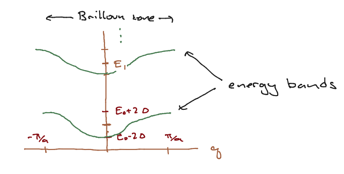

# Periodic potentials

Here we will consider a non-relativistic particle with Hamiltonian
```{math}
H = \frac{{\hat p}^2}{2m} + V(x)
```
where $V(x) = V(x + a)$. That is, the potential is *periodic* with period $a$. This is the model for an electron moving through a crystal lattice, where the atoms are in a regular array with spacing $a$. Of course an actual 2-d or 3-d lattice will have a more complicated and interesting structure, but the 1d example we'll discuss here will already introduce some basic concepts of energy bands and Brilloun zones which appear in more realistic situations. 

We will discuss a simple example, and then make some general statements about such potentials.

## The tight binding approximation

A model for a potential is shown below; the potential becomes large and negative at each lattice site. In principle it could go to $-\infty$, as happens for the Coulomb attraction of an electron by a proton in three dimensions. As with the double-well potential, we expect the energy eigenstates to be extended over the metal.


We will approximate the Hamiltonian as follows. We consider a periodic lattice with $N$ sites. At each lattice site, if we did not allow the electrons to hop, the electron can take one of a set of eigenstates $E_{i = 1,\ldots, n}$. These approximate bound states to the individual atoms. The Hilbert space for $N$ lattice sites is then $\cH = \CC^n \oplus \CC^n \oplus \cdots \oplus \CC^n$ where there are $N$ such factors of $\CC^n$ so that the total dimension of the Hilbert space is $nN$. We can also wrote this as $\CC^N \oplus \CC^N \oplus \cdots \oplus \CC^N$ where there are $n$ factors of $\CC^N$. Each of these factors corresponds to one of the $n$ energy levels of the electron on each site. This is the presentation we will use. Either way, we assume that we can take as an orthonormal basis $\ket{i, I}$ with $i = 1,\ldots, n$ labeling the energy eigenstates of a single atom and $I = 1,\ldots, N$ labeling the atoms. This orthonormality is part of the approximation. In actual fact atomic wavefunctions have infinite extent, and so we would expect an electron more or less localized about one atom to have a wavefunction that extends to the other atom.

We assume, first, that the Hamiltonian is diagonal in the basis of the atomic eigenstates, that is,
```{math}
\bra{i, I} H \ket{j, J} = \delta_{ij}C(i,I,J)
```
We next assume that the nonvanishing matrix elements of the Hamiltonian are either diagonal in $I,J$ or connect $J = I \pm 1$, where we let $I = 0$ be the same as $I = N$ and $I = N+1$ be the same as $I = 1$. Thus,
```{math}
\begin{align} 
\bra{i, I} H \ket{i, I} & = E_i\ \forall I\\
\bra{i, I} H \ket{i, I \pm 1} & = - \Delta_i \forall I
\end{align}
```

We have already discussed this Hamiltonian in {ref}`section:lattice` for fixed $i$; it is a discrete model of the free particle. We argued based on the Fourier transform that this was well approximated by $H \propto {\hat p}^2 + \eps_i$ for some number $\eps_i$. I will argue this another way. We see that
```{math}
H\ket{i, I} = E_i\ket{i, I} - \Delta_i\left(\ket{i, I-1} + \ket{i, i + 1}\right)
```
Similarly, 
```{math}
\bra{i, I} H \ket{\psi} = E_i \brket{i, I}{\psi} - \Delta\left(\brket{i, I-1}{\psi} + \ket{i, I+1}{\psi}\right)
```
Lets assume the lattice has spacing $a$, and $a I = x$. Then (dropping the $i$ index) we have
```{math}
\bra{I} H \ket{\psi} = E\psi(x) - \Delta\left(\psi(x + a) + \psi(x - a)\right)
```
But 
```{nath}
2 \psi(x) - \psi(x - a) - \psi(x + a) \sim - a^2 \psi''(x) + \cO(a^4)
```
so our Hamiltonian is a good discrete representation of the Laplacian.

As we showed in {ref}`section:lattice`, eigenstates of this Hamiltonian take the form
```{math}
\ket{q} = \frac{1}{\sqrt{N}}\sum_{n = 1}^N e^{2\pi i(na) q/Na}\ket{n}
```
where $q \in \left\{0,\ldots, N-1\right\}$. We can write $x = na$, $k = 2\pi q/(Na)$ (where $Na$ is the total length of the lattice) to find
```{math}
\ket{k} = \frac{1}{\sqrt{N}} \sum_x e^{i k x} \ket{x}
```
We computed the eigenvalue of the Hamiltonian to be:
```{math}
E(k) = E_i - 2\Delta\cos(ka)
```
where $k \in \left\{ \frac{2\pi}{Na}, \frac{4\pi}{Na},\ldots,\frac{2\pi(N-1)}{Na} \right\}$. Note that (for $N$ even) we can just as well write this as
$k \in \left\{ - \frac{\pi}{a},\ldots,\frac{\pi}{a} - \frac{2\pi}{Na}\right\}$ which is more symmetric. 

Now if $\Delta \ll |E_i - E_{i \pm 1}|$, the energy eigenstates form a set of bands, each one centered about $E_i$. The structure of the bands is shown in the figure below.



The splitting of the spectrum into discrete, non-overlapping energy bands is characteristic of the structure of energy eigenstates in a crystal lattice. The range of (pseudo)momenta is called the *Brilloun zone*. 

In real materials, in the ground state, we can often treat the electrons as nearly nononteracting (this is not trivial). By the Pauli Exclusion Principle, which we will review, nly one electron per spin state can occupy an enery eigenstate so we start "filling the band" from the bottom. Whether the highest-energy electron sits in the middle or the top of the band determines the conduction properties of the material; if one can add a small amount of energy to excite an electron, one has a conductor; if one must add a large amount to excite an electron, one has an insulator, and so on.  Computing the structure of these bands is a major activity in solid state physics.

## Bloch's theorem

Now that we have worked through an example, we will embark on a more general discussion of the structure of the energy eigenstates for a periodic potential. To do so, we will first introduce an operator that induces translations. This operator will help us organize the energy spectrum.

### Discrete translation operator.

We will discuss quantum mechanical symmetries more generally very soon; I will simply construct the operator implementing discrete translations.

Recall that for any operatoer $f({\hat p})$, $[{\hat x},f({\hat p})] = i\hbar \frac{\partial}{\partial p} f({\hat p})$. We can see this by assuming that $f$ can be expressed in a Taylor series in ${\hat p}$, and showing that $[{\hat x},{\hat p}^n] = i\hbar n {\hat p}^{n-1} = i\hbar \frac{\del}{\del p}{\hat p}^n$. 

Now consider the operator $T_a = e^{-i {\hat p} a/\hbar}$. You can show easily that this is a unitary operator. Furthermore, clearly $T_a^{\dagger} = T_{-a}$. Now, by the above,
```{math}
[{\hat x}, T_a] = a T_a
```
Thus 
```{math}
{\hat x} T_a \ket{x_0} = (x_0 + a) T_a \ket{x_0}
```
Since $T_a$ is unitary and thus norm preserving, we have $T_a\ket{x_0} = \ket{x_0 + a}$. 

Now, if we take the adjoint, we find $\bra{x_0}T_a = \bra{x_0 - a}$, and thus
```{math}
\ket{x_0} T_a \ket{\psi} = \psi(x_0 - a)
```

Using the above, we can quickly show that $T_a^{\dagger} {\hat x} T_a = {\hat x} + a$. Next consider $T_a^{\dagger} {\hat x}^n T_a$. We can insert $T_a^{\dagger} T_a = {\bf 1}$ in between each pair of ${\hat x}$s in ${\hat x}^n$ to show that
```{math}
\begin{align}
T_a^{\dagger}{\hat x}^n T_a & = T_a^{\dagger}{\hat x} T_a T_a^{\dagger} {\hat x} T_a T_a^{\dagger} \ldots T_a^{\dagger} {\hat x} T_a\\
& = ({\hat x} + a)^n
\end{align}
```
If $V({\hat x})$ can be expressed as a power series, then $T_a^{\dagger}V({\hat x}) T_a = V({\hat x} + a)$. We assume this is true in general. 

If $V({\hat x} + a) = V({\hat x})$, then
```{math}
T_a^{\dagger} V({\hat x}) T_a = V({\hat x}) \Rightarrow [T_a, V({\hat x})] = 0
```

## Consequences of discrete translational symmetry

If $H = \frac{p^2}{2m} + V(x)$, this means that $[T_a, H] = 0$. Now the statement that commuting Hermitian operators can be simultaneously diagonalized is also true if one or both operators are unitary. So let is consider eigenvalues of $T_a$. This is a unitary operator, so the eigenvalues must be of the form $e^{i k a}$ for some $k \in \left[- \frac{\pi}{a}, \frac{\pi}{a}\right]$. Let us then consider eigenstates of $T_a$:
```{math}
T_a \ket{\psi_k} = e^{i k a}\ket{\psi_x}
```
Taking the innner product of both sides with $\ket{x}$, and setting $\psi_k(x) = \brket{x}{\psi_k}$, we find
```{math}
\psi_x(x - a) = e^{i k a}\psi_k(x)
```
If we define $u_k(x) = e^{i k x} \psi(x)$ then $u_k(x - a) = u_k(x)$, so $h_k$ is invariant under $x \to x + a$. We have thus shown that
```{math}
\psi_k(x) = e^{-i k x} u_k(x)
```
for any eigenstate of $H$, where $u_k(x)$ is invariant under shifts by $x \to x + a$. This is called *Bloch's Theorem*; $\hbar k$ is called the *pseudomomentum*. It is not quite the momentum in the usual case because $u_k$ itself will be made of up Fourier components which are periodic under $x \to x + a$, that is, of the form %$e^{2\pi i n x/a}$, so the actual momentum of this component will be $\hbar(k + \frac{2\pi n}{a})$. Furthermore, while the pseudomomentum is conserved, the the full momentum is not as translation invariance does not necessarilty hole. This momentum may jump by $\frac{2\pi n}{a}$ due to scattering off of the background lattice.

Note that the tight binding approximation has this structure trivially. 


