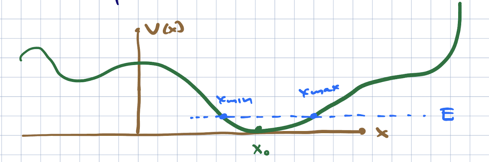

# The simple harmonic oscillator

The next potential we wish to consider is the *simple harmonic oscillator,
```{math}
:label: sho_ham
H = \frac{p^2}{2m} + \half m \omega^2 x^2
```
Tihs is exactly solvable in both classical and quantum mechanics. Why do we consider such a potential, besides this nice fact of classical solvablility? Because at low energies, it is often a good first approximation to a given potential.

Consider a more general 1d potential problem,
```{math}
H = \frac{p^2}{2m} + V(x)
```
We will consider energies so that the classically allowed region is near the absolute minimum of the potential. 



Now if we set $x = x_0$ as the location of this classical minimum, we can approximate $V(x)$ as:
```{math}
:label: approx_potential
V(x) = V(x_0) + (x - x_0) V'(x_0) + \half (x - x_0)^2 V''(x_0) + \frac{1}{3!} (x = x_0)^3 V'''(x_0) + \ldots
```
Since we are looking near a minimum, $V'(x_0) = 0$. We can also shift the total energy (since it is irrelevant in classical and qauntum mechanics in the absence of gravity). This expansion is a good one if the higher order terms in $(x - x_0)$ are smaller than the lower-order ones. In particular, we can approximate the potential by the quadratic term if
```{math}
:label: quadratic_condition
\half \big| V''(x_0) (x - x_0)^2\big| \gg \frac{1}{3!} \big|V'''(x_0)(x - x_0)^3\big| \Rightarrow |x - x_0| \ll \frac{3 V''(x_0)}{V'''(x_0)}
```
You might have been tempted to say "the third derivtive of $V$ at $x_0$ is smaller than the second derivative" but that makes no sense -- these quantities have different dimensions. In fact the viability of the approximation also depends on $|x - x_0|$ being small enough. This depends on the energy. We can see thius best classically: for larger energies, the particle has a larger range, and eventually the criterion {eq}`quadratic_condition` will break down.

This story is actually pretty general; for many problems, teh Lagrangian can be approximated at low energies by a Lagrangian which is quadratic in the phase space variables; if the system is stable, it can be reduced further to a collection of harmonic oscillators. This includes the electromagnetic field. Higher order or anharmonic terms (which in quantum field theory arises from particle interactions) can be treated in an approximation scheme known as *perturbation theory*.

Finally to get {eq}`sho_ham`, we set $V'(x_0) = m \omega^2$. We can define $\omega$ this way (given $m, V(x)$). The reason for doing so becomes clear when we examine the solutions to the classical and quantum problems.

## Classical solution

As a reminder, Hamilton's equations give us:
```{math}
\begin{align}
{\dot x} & = \frac{\del H}{\del p} = \frac{p}{m}\\
{\dot p} & = - \frac{\del H}{\del x} = - m \omega^2 x
\end{align}
```
Taking the derivative of the first equation and using the second equation, we get the classical SHO equation
```{math}
{\ddot x} + \omega^2 x = -
```
which has as a general solution
```{math}
x(t) = X_{max} \cos(\omega t + \delta) \Rightarrow p = - X_{max} m\omega \sin(\omega t + \delta)
```
and $A,\delta$ are set by the initial conditions on $x(t_0), {\dot x}(t_0)$. The total energy of this solution is 
```{math}
E = \frac{p^2}{2m} + \half m \omega^2 x^2 = \half m \omega^2 X_{max}^2
```
Thus, more energetic states travel a wider range. The frequency of oscillation in $\omega$, and the period $T = 2\pi/\omega$, are fixed.

## The quantum oscillator

To solve this problem we are going to do a bit of scaling analysis. The time-independent Schroeinger equation is:
```{math}
- \frac{\hbar^2}{2m} \frac{\del^2}{\del x^2} \psi(x) + \half m \omega^2 x^2 \psi(x) = E \psi(x)
```
Now we will let $x = L y$ and multiply the equation by $m L^2/\hbar^2$:
```{math}
- \half \del_y^2 \psi(y) + \half \frac{m^2 \omega^2 L^4$}{\hbar^2} y^2 \psi(y) = \frac{mL^2}{\hbar^2} E \psi
```
setting $L  = \sqrt{\frac{\hbar}{m\omega}}$ and $\CE = \frac{E}{\hbar\omega}$, we have
```{math}
- \half \del_y^2 \psi(y) + \half y^2 \psi(y) = \CE\psi(y)
```
what we have learned is that the typical trange of variation of the wavefunction is set by $\sqrt{\hbar}{m\omega}$ and the energy scales are set by $\hbar\omega$. 

We will solve this with a clever trick. We can write $a = \frac{1}{\sqrt{2}}(del_y + y)$ and $a^{\dagger} = \frac{1}{\sqrt{2}}(- \del_y + y)$. The fact that this is the correct expression for teh Hermitian conjugate can be deduced using the standard norm on wavefunctions, or we can note that
```{math}
\del_y = L \del_x = \frac{i L}{\hbar} p 
```
so that if $p^{{\dagger} = p$, $()\del_y^{\dagger} = - \del_y$. Now we can write
```{math}
	a^{\dagger} a = \half(-\del_y + y)(\del_y + y) = \half(-\del_y^2 + y^2 - 1)
```
Thus,
```{math}
H = \hbar\omega(a^{\dagger} a + \half)
```

Note that we can write
```{math}
:label: aadagger_defs
\begin{align}
a & = \left(\frac{m\omega}{2 \hbar}\right)^{\half} {\hat x} + i \left(\frac{1}{2\hbar\omega m}\right)^{\half} {\hat p}\\
a^{\dagger} & = \left(\frac{m\omega}{2 \hbar}\right)^{\half} {\hat x} - i \left(\frac{1}{2\hbar\omega m}\right)^{\half} {\hat p}
\end{align}
```

It is an important fact that
```{math}
:label: aad_ccr
\begin{align}
& [a,a^{\dagger}] = 1\\
& \Rightarrow [H,a] = - \hbar\omega a\ ; [H,a^{\dagger}] =\hbar\omega a^{\dagger}
\end{align}
```

We can use these facts to define the spectrum and generate solutions to the TISE. First, let us assume we have a normalized energy eigenstate $\ket{E}$ with energy $E$. Then using {eq}`aad_cr` we find
```{math}
\begin{align}
H a^{\dagger} \ket{E} & = (E + \hbar\omega) a^{\dagger}\ket{E}\\
H a \ket{E} & = (E - \hbar\omega) a \ket{E}
\end{align}
```
so that
```{math}
\begin{align}
a\ket{E} & = c_-(E) \ket{E - \hbar\omega}\\
a^{\dagger} \ket{E} & = c_+(E)\ket{E + \hbar\omega}
\end{align}
```
where $c_{\pm}(E)$ are adjusted so that the states have unit norm.

Now let us deduce the spectrum. Using $H = \hbar\omega(a^{\dagger} a + \half)$, for any state $\ket{\psi}$ with norm 1, 
```{math}
\bra{\psi} H \ket{\psi} = \hbar\omega\left(\bra{\psi} a^{\dagger} a\ket{\psi} + \half \brket{\psi}{\psi}\right) = \hbar\omega \left(||a\ket{\psi}||^2 + 1\right) > 0
```
If $\ket{\psi}$ is an energy eigenstate with energy $E$, $\bra{\psi} H \ket{\psi} = E$, so this means $E$ must always be positive.

First, we will find the minimum energy solution $\ket{E_0}$. Since there are no states with lower energy, we must have $a\ket{E_0} = 0$. Since $H = \hbar\omega(a^{\dagger} a + \half)$ this means that $H\ket{E_0} = \half\hbar\omega \ket{E_0}$, or $E_0 = \half\hbar\omega$. Excited states with energy $E = \hbar\omega(n + \half)$ are proportional to $(a^{\dagger})^n \ket{E_0}$. These are all of the states. The ground state and the states above are nondegenerate. If there were any states with energies different from $\hbar\omega(n + \half)$, say with energy $\hbar\omega(n + \half) + \eps$, with $0 < \eps < \hbar\omega$, we could act on them repeatedly with powers of $a$ and lower the energy in units of $\hbar\omega$. Sincse the starting point has the form $\hbar\omega(n + \half) + \eps$, these other states will have energy $\hbar\omega(n - k + \half) + \eps$. None of these will be equal to $\half\hbar\omega$, so none can be annihilated by $a$ and $k$ can be arbitrarily large, and the energy arbitrarily negative. But we have proven the energy must be positive, so such states do not exist.

From here on out, we call the eigenstates $\ket{n}$, $n \in \{0,1,2,\ldots\}$, with energies $E_n = \hbar\omega(n + \half)$. They are also eigenstates of $a^{\dagger} a$ with eigenvalue $n$. We thus sometimes call $a^{\dagger} a$ the *number operator*. One motivation is that when we quantize the electromagnetic field, it behaves as a collection of harmonic oscillators -- one for each polarization and wavenumber -- and $n$ becomes the number of photons. We thus call $a^{\dagger}$ a *creation operator* and $a$ an *annihilation operator*. 

Next we wish to construct the wavefunctions. We can write $a\ket{0} = 0$ using the differential form of the operator as
```{math}
(\del_y + y)\psi_0(y) = 0
```
This has the unique solution (after imposing $\brket{0}{0} = 1$):
```{math}
\psi_0(y) = A e^{- y^2/2} \rightarrow \psi_0(x) = \left( \frac{m \omega}{\pi \hbar}\right)^{1/4} e^{- \half \frac{m \omega x}{\hbar}}
```

Next we wish to find the excited states by applying the operator $a^{\dagger}$. 
Using the commutation relations, we can find $c_{\pm}$. Now
```{math}
\bra{n} a^{\dagger} a \ket{n} = n = |c_-(n)|^2 \Rightarrow c_-(n) = \sqrt{n}
```
for $c_+$, we use the fact that $a a^{\dagger} = a^{\dagger} a + 1$, so that
```{math}
\bra{n} a a^{\dagger} \ket{n} = |c_+(n)|^2 = \bra{n}(a^{\dagger} a + 1)\ket{n} = n + 1 \Rightarrow c_+(n) = \sqrt{n+1}
```
Thus,
```{math}
\ket{n} = \frac{1}{\sqrt{n!}} (a^{\dagger})^n \ket{0}
```
When we apply $n$ powers of $a^{\dagger} = \frac{1}{\sqrt{2}}(-\del_y + y)$ to a Gaussian, we can see that the result is an $n$th order polynomial times the same Gaussian. These polynomials have a name -- they are the *Hermite polynomials*. The resulting wavefunctions are
```{math}
\psi_n(x) = \brket{x}{n} = \frac{1}{\sqrt{2^n n!}} \left(\frac{1}{\pi^{1/4} L^{1/2}}\right) e^{- \frac{x^2}{2 L^2}} H_n\left(\frac{x}{L}\right)
```
where $L = \sqrt{\frac{\hbar}{m\omega}$, and $H_n$ can be looked up in textbooks. One point of these functions is that they form a complete orthonormal basis of square-integrable functions, because they are eigenfunctions of a Hermitian operator.

