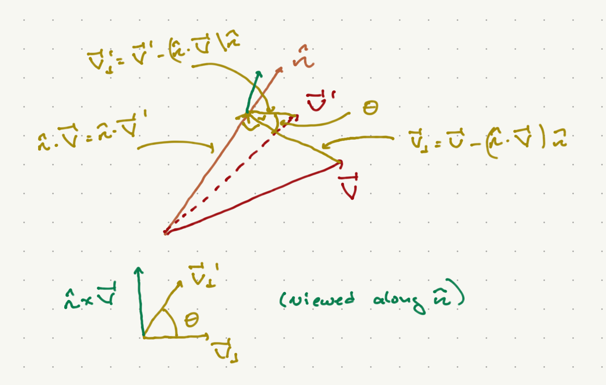

# The Rotation Group

The rotation group ends up being a particularly powerful tool for studying three-dimensional systems, most famously atomic systems for which the Coulomb potential is rotationally invariant (independent of the direction of the separation between charged objects.)

In general rotations acting on vectors in $\CR^d$ are defined as real linear ransformations that preserve the norm. Thus
```{math} 
V^{I = 1,\ldots D} \to (V')^I = R^I_J V^J
```
where $R$ is a $d \times d$ matrix. Preservation of the norm means that
```{math}
(V')^I (V')_I = V^J R^I_J (R^T)^K_I V_K = V^K V_K
```
This last equality works if and only if $R^T R = {\bf 1}$, that is, if $R^T - R^{-1}$. Such matrices are called *orthogonal*.

Successive rotations are implemented by multiplying the corresponding matrices. You can convince yourself quickly that the product of two orthogonal matrices is itself orthogonal:
```{math} 
(R_1 R_2)^T = R_2^T R_1^T = R_2^{-1} R_1^{-1} = (R_1 R_2)^{-1}
```

The corresponding group of rotation is thus the group of orthogonal matrices under matrix multiplication, which is known as $O(d)$ or the "orthogonal group".

Note that since 
```{math}
	{\rm det} R^T R = ({\rm det} R)^2 = {\rm det} {\bf 1} = 1
```
${\rm det} R = \pm 1$. The matrices with opposite determinants are not continuously deformable into each other, and only matrices with positive determinant are continuously deformable to the identity matrix. The group of $d\times d$ orthogonal matrices with unit determinant are called $SO(d)$ or the "special orthogonal group". It is this group which is usually taken to be the rotation group.

## Rotations in three dimensions

In this case, 
```{math}
\Pi = - {\bf 1}
```
is the parity matrix, and any member of $O(3)$ can be written as a member of $SO(3)$ times $\Pi$. Thus we will focus on $SO(3)$.

### Finite rotations

We can describe the general matrix more explicitly as follows. I calim any rotation can be described as the rotation of a vector about some axis by some angle $\theta$. We will specify the axis by the unit vector ${\hat n}$. 



As shown in the figure above, we can break up the vector ${\vec V} = {\vec V}_{\|} + {\vec V}_{\perp}$, where parallel and perpendicular are with respect to ${\hat n}$:
```{math}
\begin{align}
{\vec V}_{\|} & = ({\vec V}\cdot{\hat n}) {\hat n}\\
{\vec V}_{\perp} & = {\vec V} - {\vec V}_{\|} 
\end{align}
```
We will express ${\vec V}'$ in terms of its projection onto three orthonormal vectors: ${\hat n}$, ${\hat V}_{\perp} = \frac{{\vec V}_{\perp}}{||{\vec V}_{\perp}||}$, and a third vector orthogonal to both of them. Since ${\hat n}\times{\hat V}_{\|} = 0$,
${\hat n}\times{\hat V} = {\hat n}\times {\vec V}_{\perp}$ is orthogonal to both ${\hat n}, {\hat V}_{\perp}$. Thus, we can write
```{math}
{\vec V}' = ({\vec V}'\cdot{\hat n}) {\hat n} + {\vec V}'\cdot\frac{{\vec V}_{\perp}}{||{\vec V}_{\perp}||} + \left( {\vec V}' \cdot \frac{ {\hat n} \times {\vec V} }{ ||{\hat n}\times {\vec V}|| }\right) 
{\hat n}\times{\vec V}
```
Now 
```{math}
||{\vec V}'|| = ||{\vec V}|| = ||{\hat n}\times{\vec V}||
```
Furthermore, we can see from the figure that 
```{math}
\begin{align}
{\vec V}' \cdot{\vec V}_{\perp} & = ||{\vec V}||\cdot ||{\vec V}_{\perp}|| \cos\theta\\
{\vec V}'\cdot({\hat n}\times{\vec V}) & = ||{\vec V}|| \cdot ||{\hat n} \times{\vec V}|| \sin \theta
\end{align}
```
Putting all of this together, we have
```{math}
{\vec V}' = \cos\theta {\vec V} + (1 - \cos\theta){\hat n}\cdot{\vec V} {\hat n} + \sin
theta {\hat n}\times{\vec V}
```
Writing this as $(V')^I = R^I_J V^J$, 
```{math}
:label: rot_matrix
R^I_J = \cos\theta \delta^I_J + (1 - \cos\theta) n^I n_J + \sin\theta \epsilon^I{}_{JK} n^K
```
Here $\epsilon_{IJK}$ is the totally antisymmetric tensor defined in the appendices. Note that I have raised and lowered various indices. In the present case, this operation does not change the numerical value of any of the vectors or tensors. I leave it as an exercise to show that this is an orthogonal matrix.

You can see that there is a 3-parameter family of such matrices, labeled by $\theta$ and by the unit vector ${\hat n}$. As it happens, the demand of orthogonality leaves only 3 independent parameters specifying a $3\times 3$ orthogonal matrix, and in fact all members of $SO(3)$ can be written in this way. 

### Infinitesimal transformations

For infinitesimal rotations, $\cos \theta \sim 1 - \half \theta^2 + \cO(\theta^4)$, $\sin \theta \sim \theta + \cO(\theta^3)$. Putting this into Equation {eq}`rot_matrix` and keeping twerms only up to $\cO(\theta)$, we have
```{math}
R^I_J \sim \delta^I_J + \theta \epsilon^I{}_{JK} n^K 
```
Since this is linear in ${\hat n}$ and we can write a general vector ${\hat n}$ as a linear combination of ${\hat x}, {\hat y}, {\hat z}$, we can generate general infinitesimal transformations from rotations about each of these axes. Now wroting $R(n) = 1 - i \theta J_I n^I/\hbar$, we have
```{math}
\begin{align}
J_x & = i\hbar \begin{pmatrix} 0 & 0 & 0 \\ 0 & 0 & -1 \\ 0 & 1 & 0 \end{pmatrix}\\
J_y & = i\hbar \begin{pmatrix} 0 & 0 & 1 \\ 0 & 0 & 0 \\ -1 & 0 & 0 \end{pmatrix}\\
J_z & = i\hbar \begin{pmatrix} 0 & -1 & 0 \\ 1 & 0 & 0 \\ 0 & 0 & 0 \end{pmatrix}
\end{align}
```
We will see later why we use this normaization by $\hbar$. Finally, recall that the group structure can be built from the commutation relations of the individual matrices. For these, you can show via brute force that
```{math}
[J_I, J_J] = i\hbar \epsilon_{IJK} J_K
```

Given all of this, we can build up any finite rotation from these matrices by a succession of infinitesimal rotations. That is, consider a rotation about ${\hat n}$ by an angle $\theta$. We can achieve this with $N$ successive rotations about the same axis, each with angle $\theta/N$. As $N \to \infty$, each rotation is well approximated by 
```{math}
	R(\theta/N, {\hat n}) = {\bf 1} - i \frac{\theta}{N} \hbar \frac{{\vec J}\cdot{\hat n}}{\hbar}
```
Now 
```{math}
\begin{align}
\lim_{N\to\infty} \left(1 + \frac{x}{N}\right)^N & = 
\lim_{N \to infty} e^{N \ln (1 + x/N)}\\
& = \lim_{N \to infty} e^{N \left( \frac{x}{N} + \frac{x^2}{2 N^2} + \ldots\right)} \\
& =  \lim_{N \to infty} e^{x + \cO(1/N)} = e^x
\end{align}
```
Thus, we can write
```{math}
R(\theta, \hat n) = \lim_{N\to\infty} R(\theta/N,{\hat n})^N = e^{- i \theta {\vec J}\cdot{\hat n}/\hbar}
```

## The Group $SU(2)$

The group of $n\times n$ unitary matrices is called $U(n)$. In generak the determinants of such matrices are pure phase. The *special unitary group* $SU(n)$ consists of all such matrices with determinant $1$. Since the determinant of the product oof matrices is the product of their determinants, this is a genuine subgroup of $U(n)$.

We wish to describe the simplest special unitary group, $SU(n)$. All such matrices take the form
```{math}
M = \begin{pmatrix} a & b \\ - b^* a^* \end{pmatrix}
```
where $a, b \in \CC$, $|a|^2 + |b|^2 = 1$. We can rewrite these in terms of the Pauli matrices:
```{math}
M = a_r {\bf 1} + i b_i \sigma_x + i b_r \sigma_y + i a_i \sigma_z
```
where $a = a_r + a_i$, $b = b_r + i b_i$, and $a_{i,r},b_{i,r} \in \CR$. 

Now if we set $a_i, b_r, b_i \in \cO(\eps)$ for $\eps \ll 1$, the constraint $|a|^2 + |b|^2 = 1$ demands that $a_r \sim 1 + \cO(\eps^2)$. Thus, for infinitesimal transformations, 
```{math}
M \sim {\bf 1} + i \alpha {\hat n} \cdot {\vec \sigma}
```
where $\alpha = \sqrt{|a_i|^2 + |b_r|^2 + b_i|^2}$, and 
```{math}
{\hat n} = \frac{1}{\alpha}(b_i, b_r, a_i)
```
If we define ${\vec J} = \frac{\hbar}{2} {\vec \sigma}$, we have the commutation relations
```{math}
[J_I, J_J] = i \hbar \epsilon_{IJK} J_K
```
If we set $\theta = 2\alpha$, then we have
```{math}
M \sim {\bf 1} + i \theta \frac{{\vec J}\cdot{\hat n}}{\hbar}
```
which takes the same form as the infinitesimal rotation matrices in $SO(3)$, for which $J_I$ have the same commutation relations. It is tempting to state that $SO(3)$ and $SU(2)$ are the same group. As it happens, this is not quite true; rather (as we will see), $SU(2)$ is the *double cover* of $SO(3)$; that is if we map $SU(2)$ to $SO(3)$ the map is generally 2-to-1. 

